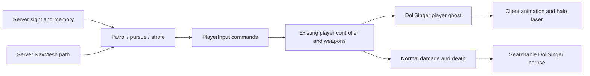

# DollSinger expedition enemies

The expedition defaults to three hostile DollSinger characters. `MoonRaidMap` exposes
enemy count (zero disables spawning), sight range and carried energy cells. Change these
on the MoonGameScene map object before starting a Host. Existing clients must rebuild
with the same project version as the Host.

Enemies have the same 100 HP, collision controller, magazine, weapon cooldown,
reload cost and ballistic projectiles as a player. They carry a rig, backpack and
four energy cells by default; used cells disappear from their inventory, and the
remaining equipment and cells drop in their corpse. Enemies spawn once per server
map session, away from a connected player's initial position, and do not respawn.

The server alone runs decisions. Sight checks use server hitboxes and physical
occluders, a 140-degree view cone (close enemies and damage alert widen attention),
45-metre detection and a six-second memory of the last observed position. Firing
requires current line of sight, a 0.4-second reaction delay and aim alignment.
There is turn speed, aim error and a pause between bursts. Enemies patrol the
authored supply positions, pursue a last known position and strafe at medium range.
They do not run client cameras or use a fake account/transport connection.

Navigation is generated asynchronously on the server within the expedition bounds.
It supplies steering directions; `FirstPersonController` retains movement authority.
Terrain and readable collider meshes use their actual geometry. Imported rock meshes
without CPU read access use conservative bounding boxes, avoiding Player-only
runtime bake errors and extra retained mesh memory. Rocks still use their original
colliders for movement and shots. There are no off-mesh links or teleport recovery.

This first version covers combat and patrol. It does not imitate a human player's
inventory management, extraction planning, complex cover selection or squad tactics.

Validation: Editor compilation and isolated session-only Host checks cover three
server enemies replicated as three client proxies, navigation/movement, real
projectile damage, line of sight with a temporary physical blocker, finite reload
cost, and one searchable death drop with input-entity cleanup. Focused checks also
verify no firing/reloading after cells run out, safe handling of cleanup entities
without a health component, and old enemy/input removal on map changes.
Windows Player (ClientAndServer) and Mac Player script compilation passed (93 and
94 assemblies). These are script checks, not complete executable builds. An additional
Dedicated Server compile is blocked by the existing `UGS_ServerBootstrap.cs` dependency
on the missing `IMultiplaySessionManager` API; the normal Host Player is unaffected.
No persistent account inventory is used by the checks. Final gameplay balance and
Windows/Mac two-machine feel need the usual Play Mode/LAN acceptance.
