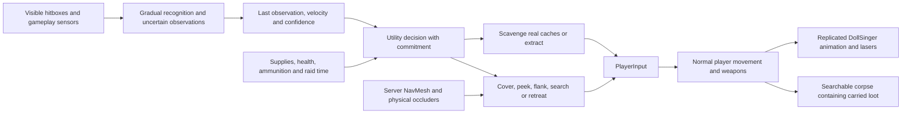

# DollSinger PMC raid actors

The three DollSinger actors are independent raiders with supplies, finite ammunition
and an extraction objective. They use the same player ghost, movement controller,
weapon cooldowns, reload cost, ballistics, health and death inventory as humans.
Other PMCs are hostile competitors too; these actors are not a coordinated guard squad.
They have no transport clients or persistent accounts.

## Raid decisions

PMCs choose reachable caches with different route preferences, spend 2.5 seconds
searching within pickup range and line of sight, then transfer actual shared items
through `LootInventoryExchange.TryApply`. Quantities and versions follow the normal
inventory transaction; there are no manufactured rewards. Cells go into pockets/rig
before backpack space. Backpack cells must move into an accessible slot before
reloading. A loaded secondary weapon remains an option when cells run out.

Three searched caches, critical health, exhausted ammunition or the departure time
make a PMC plan to leave. Extraction requires the existing radius, height tolerance
and eight-second dwell; a visible threat, recent damage or pressure interrupts it.
Extraction removes the actor and input without making a corpse. The NPC takes its
loot out of this raid; it is not credited to any human account or an NPC database.
A killed PMC drops its real remaining inventory. Permanent actor removal retires
its leaderboard entry after queued kill-feed messages have resolved their names.

## Perception and combat

Sight uses three physical rays (head, torso, hips), range, view angle, movement and
global expedition daylight. Suspicion accumulates before confirmation. Decision code
uses observation records rather than a hidden opponent's current transform. Lost
sight decays confidence and expands search around the remembered position and
observed velocity. Sound estimates can update memory but carry positional error.
Partial head exposure never changes torso aim into an automatic headshot.

Authoritative shot/reload ticks and distance travelled produce gameplay sensor events.
These are stylized suit/acoustic cues for Moonkov, not physical sound simulation in
a lunar vacuum. Distance and obstruction affect their range. Nearby gunfire and
received damage increase pressure; this version does not detect every near-miss
projectile or simulate sound propagation through individual rooms.

Decisions run at 5 Hz, with staggered perception at 10 Hz and action commitment to
avoid frame-by-frame oscillation. Aggression/caution differ between actors. Sustained
duels can trigger a flank; lost targets trigger search. Pressure favors cover, low HP
or no ammunition favors withdrawal, and an empty magazine favors reloading. Turn
rate, recognition/reaction delays, burst pauses, first-shot error, movement and
pressure affect shooting. Projectile lead uses observed velocity and real weapon
data. The final aim point follows the imperfect look ray so it cannot bypass aim
error or turn rate. Firing still requires current physical line of sight.

Cover candidates must block a torso ray from the remembered threat. Reachable
lateral peek positions improve their score. Path length, exposed route corners,
distance and temporary reservations affect selection. Brief peeks alternate with
concealment. Navigation accepts complete paths only, retries stalled movement and
skips unreachable supply objectives. The player controller retains movement
authority; there is no teleport recovery or moving NavMeshAgent.

## Configuration and inspection

- `MoonRaidMap` retains enemy count, sight range and starting cells. Zero disables AI.
- `Assets/Resources/Moonkov/DollSingerAI.asset` holds recognition/reaction/memory,
  night sight, preferred range, aim error, retreat health, cache/departure goals,
  search time and scheduling. Rebuild both platforms after changes.
- During Host Play Mode, open **Moonkov → AI → PMC Debugger** for each actor's
  decision/reason, confidence, pressure, supplies, path failure and extraction timer.
  Optional Scene drawing shows route, remembered contact and cover/peek.

The bounded runtime NavMesh bake uses terrain and collider geometry. Imported
unreadable meshes use conservative bounding boxes for Player compatibility.
Scene cover density and nav connectivity limit tactical choices. Night visibility
uses the global clock, not per-character physical shadow evaluation. Healing,
crouching and grenades await corresponding player abilities. Squad communication
and authored tactical links remain future work.

Focused Host checks passed: three moving server actors and three client proxies;
gradual recognition; a physical blocker preserves last-known position; low HP and
exhausted ammunition trigger retreat; timed search transfers real cache contents
without duplicating quantities; extraction dwell removes actor/input without a
corpse. Additional focused checks passed for physical cover selection, a completed
flank returning to engagement, unreachable path rejection, queued leaderboard spawn
cancellation, and death/extraction/map cleanup of inventory, inputs and scoreboard.
Persistence was disabled for Host checks. Windows ClientAndServer and Mac Client
Player script compilation passed (93 and 94 assemblies respectively); these are not
complete executable builds. Human Play Mode/LAN acceptance judges tactical feel.
