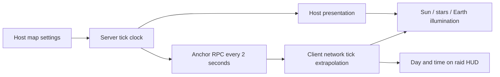

# Dynamic expedition clock

`MoonRaidMap` owns the Host settings: Start Hour (default 07:00), Day Length Minutes
(default 24 real minutes per 24 game hours), and Time Running. The clock starts when
the server loads the map and continues across individual player deaths/extractions
and redeployments. A new map/server session starts from the configured hour.
This is an accelerated gameplay day, not an astronomical lunar rotation simulation.

The server sends a current clock anchor immediately to joining players, then every
two seconds. Each client evaluates that anchor using NetCode time, including partial
ticks and tick wraparound; its frame rate does not determine the passage of game time.
Clock packets identify the server session and source connection, so reconnecting to a
restarted server accepts its fresh clock even if its sequence counter is lower.
Pausing or changing day length in the Host's map Inspector preserves the current hour
and immediately sends the new rate. Changing Start Hour takes effect on the next map
session. Local client settings do not change the authoritative clock. The raid's real
countdown stays separate, and opening a client's pause menu does not freeze the world.

`ExpeditionClockPresentation` is attached to Moon Scene Lighting in MoonGameScene.
It uses the existing `MoonSceneLighting` runtime sky material. Sunrise is at 06:00,
noon at 12:00, sunset at 18:00; the sun follows the scene's original azimuth and retains
its authored daytime intensity. The existing vacuum sky keeps its black background,
solar disk, stars and changing Earth phase. There is no atmospheric sky or fog.
Night Ambient is a faint adjustable gameplay fill; set it to black for complete lunar
darkness. Dynamic sun state and render settings are restored when lighting is disabled.
Headless servers simulate the clock without rendering it.

The HUD time follows the existing status panel visibility (hold H or enable Always Show
HUD). Both Host and client executables must be rebuilt together because a clock RPC
has been added to the network protocol.

Validation uses an isolated session-only Host with its actual client RPC receiver:
clock delivery/agreement, rate continuity, pause/resume, initial-connection sync path,
server-session replacement with a lower sequence, stale/wrong-source rejection, noon
and midnight sky/light state, and sun restoration passed. Clock math also covers midnight,
fractional ticks and tick wraparound. This does not replace the final two-machine visual
acceptance of night brightness and cycle speed.
Windows Player (ClientAndServer) and Mac Player script compilation passed with 93 and
94 assemblies respectively; complete executable builds were not run by these checks.
