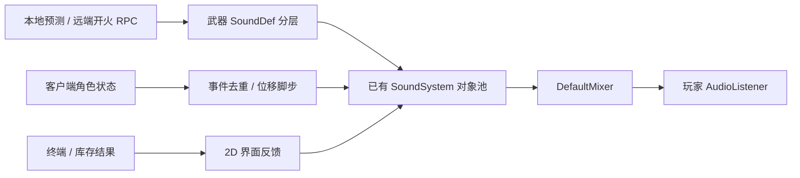

# Moonkov 音效系统

已接入 FPS_Template 当前的网络 DollSinger 流程。音源全部来自 Sonniss **GDC 2024 Game Audio Bundle (Part 8)**，没有合成音源或自行录制。继续使用模板的 `SoundSystem`、`SoundEmitter`、`SoundGameObjectPool` 和 `DefaultMixer`。

## 已有行为

| 流程 | 播放方式 |
| --- | --- |
| 光环连射 | 4 个金属敲击变体随机且不连续重复 + 明亮金属叮声层，最大听距 70/40 米 |
| 光环左轮 | 真实 .445 SuperMag 单发录音（2 个变体）+ 能量尾声层，最大听距 90/60 米 |
| 充能 / 换弹 | 光环用设计过的能量换弹音；左轮用真实转轮开合退壳录音，每个新事件播放一次 |
| 部署成功 | 铜锣成功音 + 安卓语音 "Carrying out orders" 叠层，在角色生成时播放 |
| 弹丸命中 | 客户端轨迹碰撞时在命中位置播放金属冲击；服务器仍独立判定伤害 |
| 脚步 | 客户端实际水平位移累计；月壤与金属各 4 个变体，附低音量衣物层 |
| 起跳 / 落地 / 受击 | 客户端表现层观察网络事件 tick；初次接入不重播历史事件 |
| 尸体落下 | 新尸体通知播放身体撞击，超过 0.35 秒的历史尸体不补播 |
| 武器切换 | 当前拥有者的装备声 |
| 终端和战局按钮 | 点击、键盘确认、限频悬停；禁用按钮不播放。所有 UIDocument 自动绑定 |
| 库存操作 | 收到操作结果才播放装备反馈或错误反馈；本地非法放置有错误声 |
| 打开 / 关闭背包、缓存 | 液压舱门机械声 |
| 撤离 / 战局结束 | 成功播放铜锣，失败播放单声警铃 |
| 飞船终端 | 三层实录混合的低音量座舱循环；进入战局时淡出；月球室外不播放风声 |

射击继续走原有路径：自己的开火使用预测事件，远端使用既有 RPC；既有拥有者 RPC 排除逻辑仍生效。音频在 DollSinger 分支提前返回之前触发，也不再依赖异步枪口特效加载成功。没有新增音频 RPC 或改动服务器伤害规则。



## 修复的间歇性无声缺陷

有两个各自独立的根因，表现不同：一个是**进战局后**大面积消失，一个是**死亡后或撤离回飞船后**完全静音。

### 一、玩家角色销毁后，场景里没有启用的 AudioListener

`PlayerGhost` 在客户端拥有角色生成时会禁用场景里**所有** AudioListener，再把监听器挂到角色模型上：

```csharp
foreach (var a in audioListeners) { a.enabled = false; }
m_OwnerVisuals.AddComponent<AudioListener>();
```

这个监听器随角色模型一起销毁，但**没有任何地方把其它监听器重新启用**。Unity 在场景中没有启用状态的 AudioListener 时不产生任何声音，于是：

- 战局中死亡 → 结算界面（KILLED IN ACTION / CONTINUE）整个静音
- 撤离成功 → 回到飞船后整个游戏静音

修复：记录被抑制的监听器与本 ghost 新增的监听器，在 `OnGhostPreDestroy()` 里恢复（`RestoreAudioListeners()`），并显式重新启用常驻相机监听器。`MoonkovAudioEnvironment` 在回到飞船时也会再确认一次相机监听器处于启用状态，作为独立的兜底。

### 二、发射器对象池复用时的 FadeOutTime


`SoundEmitter.FadeOutTime` 同时充当"请停止"标志：`SoundEmitter.Update()` 一旦读到 0 就立刻 `Kill()`。但 `Init()`（对象池每次复用都会调用）**从不重置它**。飞船环境音在进入战局时淡出，淡出结束后该 emitter 永远停在 0；而它又是池中索引最小的空闲槽位，于是之后几乎每个一次性音效都被立刻杀掉。只有同一帧内发出的第二个声音会拿到下一个 emitter 而正常播放——这正好对应"有时候没有声音"。

| 缺陷 | 影响 | 修复 |
| --- | --- | --- |
| 角色销毁后不恢复 AudioListener | 死亡结算界面与撤离后的飞船完全静音 | `PlayerGhost.RestoreAudioListeners()` |
| `Init()` 不重置 `FadeOutTime` | 淡出过的 emitter 永久吞掉它的下一个声音；因索引为 0 而近乎全灭 | `Init()` 中创建或 `SetValue(1.0f)` |
| `Play()` 失败后 emitter 既不播放也不释放 | SoundGameObject 池每次耗尽就泄漏一个已分配槽位，累积后彻底静音 | 新分配的 emitter 播放失败时 `UnreserveAndKill()` 并返回 null |
| `PlayDelayed` / `PlayScheduled` 期间 `isPlaying == false` | 任何使用 `DelayMin/Max` 或 `StopDelay` 的 SoundDef 在起播前就被判定播放结束 | 记录 `m_PendingStartDsp`，起播时间之前计为仍在播放 |
| `Stop(info, 0)` 直接调用 `Emitter.Kill()` | 活动列表残留条目，之后可能对已改作他用的 emitter 继续 Update | `fadeOutTime == 0` 时走 `Kill(info)`，一并移出活动列表 |
| `UpdateSoundSystem` 在活动列表为空时提前返回 | 空闲时改变音量不会写进 mixer，要等下一个声音才生效 | 先更新 mixer，再判断是否更新 emitter |

另外 `Init()` 现在会重置 `RandomClipIndex`，避免复用 emitter 时"不重复上一个"的判定被前一个声音干扰。

## 按钮音效覆盖面

此前只有仓库界面（`StashScreen`）和战局 HUD（`RaidHUD`）调用了 `MoonkovAudio.BindUI`，主菜单、暂停菜单、死亡结算界面等都没有，因此这些界面的按钮完全无声。

现在由 `MoonkovUIAudio`（挂在 GameManager 上）每 0.25 秒扫描一次所有 `UIDocument` 并绑定其**根元素**，任何界面——包括以后新增的——都自动有点击、键盘确认与悬停音效。

两条约束：

- 只能绑定整个 `UIDocument` 根。若某个界面额外绑定自己的子元素，同一次点击会穿过两个已绑定祖先而播放两次。`StashScreen` 以前绑的是内部的 `stashScreen` 元素，已移除。
- `MoonkovAudio.BindUI` 现在是幂等的（用集合去重），所以界面显式绑定与扫描器绑定同一个根不会重复注册。

选中音效只保留**一个**片段：以前点击、悬停各有两个变体交替播放，同一个操作每次听起来都不一样。现在选择音只用一个片段，音高随机让重复点击不至于呆板。

## 调音基准

旧配置的电平是坏的，这与素材质量无关，是本次一并修正的重点。`LocalData/AudioRebuild/calibrate_levels.py` 可以重新测量并复现下表。

| 音效 | 旧实际峰值 | 旧实际 RMS | 新目标峰值 | 说明 |
| --- | --- | --- | --- | --- |
| 光环开火 | **-35.97 dB** | -64.76 dB | -13 dB | 旧 `EnergyShot.wav` 本身峰值仅 -22 dBFS，再衰减 14 dB，等于听不见 |
| 左轮开火 | -12.50 dB | -25.61 dB | -12 dB | 旧混音里唯一"正常"的音效，却比主武器高 23.5 dB |
| 左轮能量层 | -41.97 dB | -70.76 dB | -27 dB | 与主开火共用同一素材 |
| 落地 | -27.88 dB | -53.15 dB | -18 dB | 比脚步还轻 11 dB |
| 月壤脚步 | -29.88 dB | -55.15 dB | -20 dB | 比金属脚步低 13 dB |
| 金属脚步 | -16.80 dB | -36.60 dB | -20 dB | 相对其它音效偏响 |
| 受击 | -16.30 dB | -37.04 dB | -14 dB | |

新电平按"目标峰值 − 素材实测峰值"反推，因此每条音效的相对响度由表决定，而不是由素材本身碰巧的峰值决定。所有片段先统一峰值归一化到 -1 dBFS，再套用目标值，避免削波。

## 素材和授权

- **Sonniss GDC 2024 Game Audio Bundle (Part 8)**：609 个 WAV、约 27.5 GB，已与包内 `Filelist.xlsx` 核对。素材以 96 kHz / 24-bit 为主（477 个 96 kHz、35 个 192 kHz，仅 75 个 48 kHz），本次统一转换为 48 kHz PCM16。
- 包内每个供应商目录是**样品集**（多数只有 3–4 个文件），不是完整商业库。因此部分音效来自长录音裁剪：左轮枪声取自 `Dan Wesson 445 - FIRING - Take 2` 第 16.00 秒的单发，金属脚步取自 `Iron - Thick - HIT - Hammer` 在 1.797 / 3.584 / 5.349 / 7.019 秒的四次敲击。
- 光环步枪的金属"叮"取自 `Spade - HIT - Drumstick - Ring - Mute` 在 0.069 / 2.347 / 4.437 / 6.533 秒的四次敲击（每次叠加自身低通副本补厚度），叮声层取自 `BELLHand_Metallic Bell_ 22` 的第一声敲击。
- 成功提示音取自 `80,TheGong.wav` 的铜锣敲击（单一起音在 0.112 秒）。部署确认在此之上叠层 `CB Sounddesign - Sci-Fi Voices Volume 03` 的 `Carrying out orders`；队友到场音取自同一支铃铛的两声敲击。
- 包内**没有脚步素材库**。金属脚步用铁锤敲击铁板实录裁剪并加低通厚度；月壤脚步由 `SBvfe2_Shaking Small Wooden Box 030` 的干碎屑裁剪，叠加 `SBvfe2_Medium Rock Dropping 011` 的 200 Hz 低通层获得重量。属于对已有录音的剪辑与均衡，没有合成音源。
- 飞船环境音由列车车厢底噪、房间空调底噪与低频 drone 三层实录混合，接缝处做 2.5 秒等功率交叉淡化。
- 旧的 GDC 2019 与 Kenney UI 素材已全部不再引用，相应的 `KenneySources.json` 与 Kenney 许可文本已删除，避免记录不存在的素材。
- `Assets/Audio/Moonkov/Sources.json` 记录每个原文件、来源、许可证与 SHA-256；`Assets/Audio/Moonkov/Edits.json` 记录每个片段的裁剪区间、分层与处理。

素材可用于商业游戏并无需署名。Sonniss 素材不能作为独立素材包、项目模板或 SDK 再分发，也不能用于 AI/ML 训练；发布公开源码时需处理这些录音。具体条款见 [Sonniss 许可](https://sonniss.com/gdc-bundle-license/)。

## 调整入口

- `Assets/Resources/Moonkov/AudioLibrary.asset`：角色、界面和飞船音效引用。
- `Assets/Audio/Moonkov/SoundDefs`：23 个配置。音高范围、距离、循环等结构化参数可在 Inspector 修改。
- `Assets/Editor/MoonkovAudioSetup.cs`：**这些 SoundDef 的权威定义表**。每个音效一行，字段带名字（混音组、空间混合、目标 dB、随机范围、音高范围、循环、片段列表），电平数值来自上面的校准表。它同时把原始 FPS Sample 的 `SoundDef_PlayerSpawn`（三个角色 prefab 的 `m_SpawnSFX`）指向新的到场音，只改 clip 与字段，不动那些大 prefab。
- `Assets/Scripts/Audio/MoonkovUIAudio.cs`：扫描所有 `UIDocument` 并绑定点击 / 确认 / 悬停音效；由 `GameManager` 自动挂载。
- `Assets/DollSinger/HaloWeapon.asset`、`RevolverWeapon.asset`：发射主层、副层、换弹和冲击引用。
- 终端 `SETTINGS`：主音量、玩法音效、界面音量。使用 `Moonkov.Audio.Master / Effects / Interface` 的 PlayerPrefs 保存，玩法和界面分别控制现有 SFX / Menu mixer 参数。
- `Tools > Moonkov > Audio > Rebuild Sound Definitions`：按上面的表重建全部 SoundDef 与导入设置。**会覆盖 Inspector 里对这些 SoundDef 的手工修改**；要保留手工调音就先记下来。已存在的 asset 保留 GUID，因此库和武器的引用不会断。

`LocalData/AudioRebuild` 是本次的生成工具链。**它在 `.gitignore` 内，不会被提交**，属于本机可重跑的脚手架；真正随仓库走的记录是 `Sources.json`（原文件与 SHA-256）、`Edits.json`（裁剪区间与分层）和 `MoonkovAudioSetup.cs`（电平与结构化参数），三者足以从素材包重建全部配置。

| 脚本 | 作用 |
| --- | --- |
| `catalog_bundle.py` | 扫描素材包，输出每个文件的格式与时长到 `catalog.json` |
| `query.py` | 按包名 / 文件名 / 时长检索 catalog |
| `probe.py` | 单文件波形、电平、起始点与瞬态峰值分析，可导出波形图 |
| `survey.py` | 批量分析候选素材 |
| `build_clips.py` | 按显式切片表生成 37 个片段到 `out/`，并写出 `provenance.json` |
| `verify_clips.py` | 独立复读 `out/` 校验格式、削波、起始点与循环接缝 |
| `calibrate_levels.py` | 测量新旧素材电平并求解每条音效的目标增益 |
| `stage_clips.ps1` | 把 `out/` 同步到 `Assets/Audio/Moonkov/Clips`，删除不再引用的片段 |
| `write_provenance.py` | 生成 `Sources.json` 与 `Edits.json` |
| `verify_assets.py` | 逐行解析 22 个 SoundDef 与库、武器资产，校验循环、电平范围、片段 GUID 是否全部可解析、是否有孤立片段 |

短音效使用解压加载、48 kHz、Vorbis quality 0.85。空间音效为单声道，界面保持立体声；座舱音频使用流式加载并保持立体声。专用服务器不创建新的音频组件，继续使用模板 `SoundSystemNull`。

## 验证与边界

已用脚本在 `Assets/Audio/Moonkov/Clips` 上验证：37 个片段全部为 48 kHz PCM16、无削波采样、首个瞬态都在片段前 35% 以内；飞船环境音循环接缝的采样跳变（0.00238）小于文件自身 99.9 分位的采样间变化（0.01376），即无缝；每个片段都能追溯到 `Sources.json` 里的原文件与 SHA-256。SoundDef 侧另有 `verify_assets.py` 逐行解析资产，校验循环标志、电平/音高区间、片段 GUID 是否全部可解析、是否存在未被引用的孤立片段，以及库与两把武器的槽位是否接满。

调音**没有经过实际听音验收**。上表的绝对电平由素材实测与混音目标推导，相对关系可信，但最终手感（连射叠层、远近衰减、金属与月壤脚步的差异、充能时序、菜单音量、撤离提示）需要在实机里听一遍再微调。旧版文档就留有"调音是保守初值且从未听音"的问题，本次修正了其中可测量的部分。

目前 TerrainCollider 使用月壤脚步，其余可行走地面碰撞体使用金属脚步；落地采用月壤冲击，弹丸采用金属冲击。石块、其他地材和精确表面材质映射，以及遮挡、舱室混响，尚未实现。距离和立体声已接入，但不是完整声学模拟。独立 `DollSingerDemo` 场景没有 GameManager，仍保留原有独立角色流程；本次交付入口为 MainMenu 与网络战局。
