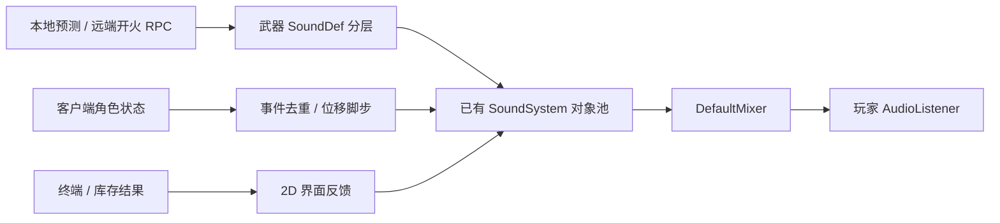

# Moonkov 音效系统

已接入 FPS_Template 当前的网络 DollSinger 流程。所有录音均来自网络免费素材；没有合成或自行录制音效。继续使用模板的 `SoundSystem`、`SoundEmitter`、`SoundGameObjectPool` 和 `DefaultMixer`。

## 已有行为

| 流程 | 播放方式 |
| --- | --- |
| 光环连射 | 专业能量发射 + 电流瞬态，两层轻微随机音高，最大听距 70/40 米 |
| 光环左轮 | 科幻重击发射 + 能量尾声，最大听距 90/60 米 |
| 充能 / 换弹 | 现有网络换弹 tick，每个角色每个新事件播放一次 |
| 弹丸命中 | 客户端轨迹碰撞时在命中位置播放金属冲击；服务器仍独立判定伤害 |
| 脚步 | 客户端实际水平位移累计，月壤与金属靴步变体，附低音量衣物层 |
| 起跳 / 落地 / 受击 | 客户端表现层观察网络事件 tick；初次接入不重播历史事件 |
| 尸体落下 | 新尸体通知播放身体撞击，超过 0.35 秒的历史尸体不补播 |
| 武器切换 | 当前拥有者的装备声 |
| 终端和战局按钮 | 点击、键盘确认、限频悬停；禁用按钮不播放 |
| 库存操作 | 收到操作结果才播放装备反馈或错误反馈；本地非法放置有错误声 |
| 打开 / 关闭背包、缓存 | 容器机械声 |
| 撤离 / 战局结束 | 成功或失败提示 |
| 飞船终端 | 低音量座舱循环；进入战局时淡出；月球室外不播放风声 |

射击继续走原有路径：自己的开火使用预测事件，远端使用既有 RPC；既有拥有者 RPC 排除逻辑仍生效。音频在 DollSinger 分支提前返回之前触发，也不再依赖异步枪口特效加载成功。没有新增音频 RPC 或改动服务器伤害规则。

## 素材和授权

- **Sonniss GDC 2019**：20 个原始录音，约 48 MB。来自官方列出的免费存档镜像，使用专业科幻武器、机械、砂砾、金属靴步、衣物和座舱素材。2026 主站下载返回 403，所以使用可下载的 2019 存档。未下载 200 GB 全集。
- **Kenney Interface Sounds / UI Audio**：5 个短 UI 音效，CC0，用于点击和悬停。
- 从已有下载录音产生 8 个裁剪文件：4 个金属靴步、2 个充能音、短确认和短错误提示。这些是素材编辑，没有生成新音效。
- `Assets/Audio/Moonkov/Sources.json` 与 `KenneySources.json` 记录每个原文件、来源、许可证和 SHA-256。
- `Assets/Audio/Moonkov/Edits.json` 记录衍生文件对应的原音频、裁剪时段和淡出处理。
- `Assets/Audio/Moonkov/Licenses` 保留 Kenney 包内原始许可，以及 Sonniss 当前官网许可链接和版本说明。

素材可用于商业游戏并无需署名。Sonniss 素材不能作为独立素材包、项目模板或 SDK 再分发，发布公开源码时需处理这些录音。具体条款见 [Sonniss 许可](https://sonniss.com/gdc-bundle-license/) 和各 Kenney 包内 CC0 文本。

## 调整入口

- `Assets/Resources/Moonkov/AudioLibrary.asset`：角色、界面和飞船音效引用。
- `Assets/Audio/Moonkov/SoundDefs`：22 个配置，可在 Inspector 修改 dB、音高范围、空间混合和距离。
- `Assets/DollSinger/HaloWeapon.asset`、`RevolverWeapon.asset`：发射主层、副层、换弹和冲击引用。
- 终端 `SETTINGS`：主音量、玩法音效、界面音量。使用 `Moonkov.Audio.Master / Effects / Interface` 的 PlayerPrefs 保存，玩法和界面分别控制现有 SFX / Menu mixer 参数。
- `Tools > Moonkov > Audio > Rebuild Sound Definitions`：重新绑定素材和导入设置。会重置这些 SoundDef 的调音值；手工调音后不要随意重建。

短音效使用解压加载、48 kHz、Vorbis quality 0.85。空间音效导入为单声道，界面保持原声道；座舱音频使用流式加载并保留立体声。专用服务器不创建新的音频组件，继续使用模板 `SoundSystemNull`。

## 验证与边界

已在 Unity Editor 中编译并检查：22 个 SoundDef、30 个有效音频引用、两个武器完整绑定、现有 mixer 分组、环境流式循环设置，以及重复 tick、旧 tick、tick 回绕时的事件抑制。原始下载的 ZIP CRC 已校验。

没有运行双客户端听音验收。需要实际游戏里听一次连射叠层、远近衰减、金属与月壤脚步、充能时序、菜单音量和撤离提示；当前调音是保守初值。没有额外写测试程序集或生成截图。

目前 TerrainCollider 使用月壤脚步，其余可行走地面碰撞体使用金属脚步；落地采用月壤冲击，弹丸采用金属冲击。石块、其他地材和精确表面材质映射，以及遮挡、舱室混响，尚未实现。距离和立体声已接入，但不是完整声学模拟。独立 `DollSingerDemo` 场景没有 GameManager，仍保留原有独立角色流程；本次交付入口为 MainMenu 与网络战局。
