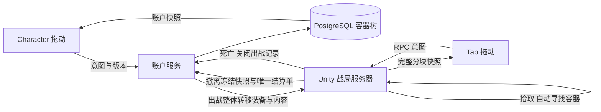

# 角色、仓库与战局容器

## 2026-10-03 完整操作链路检查

本轮实际 HTTP 拒绝为 `raid_active`，不是格子或装备类型不匹配。Unity 已在 MainMenu，所有 World 均无 RaidSession，但数据库存在 Open 出战记录。原实现销毁服务器时直接取消 HttpClient，没有把尚未结算的出战关闭；主菜单仍允许发换装请求，并把所有 409 混成一条错误。

修复覆盖以下边界：

- 销毁 World 时先冻结退出待办，在后台等待正在处理的出战请求，再关闭出战。已存在的撤离结算单优先，保持完整容器快照，不能被退出死亡覆盖。清理最多等待 20 秒；失败保留 outbox。返回主菜单和正常退出游戏会等待这次清理完成，避免菜单先开放、数据库仍锁定。
- `/auth/me` 返回 `ActiveDeploymentId`，账户角色界面明确展示未结束战局锁定；真实错误码单独显示，不再以同一条“check space, item type or active raid”掩盖原因。
- 登录/注册保留每分钟 20 次限制；普通仓库刷新和移动不再消耗登录额度。旧实现同一个 limiter 覆盖整个 `/auth`，正常整理仓库就可能收到 429。
- 账户快照先验证再替换；延迟刷新不能回滚已确认的更高版本库存。换账号/退出登录后，旧请求不能覆盖当前账户。局内移动超时检查独立于快照是否持续更新。
- 共享库存验证分两步，先检查所有 ID、类型与数量，再检查位置；空物品、未知邻居、缺失 equipment/pockets 根节点返回 Invalid，不再抛空引用。
- 出战回复必须提供有效完整容器树，不能静默使用临时装备或空装备代替持久化资产；协议错误终止该次出战并清理，而非永久重试。

当前残留的 Open 对局经过核对，仅包含 equipment、pockets 两个根节点，没有普通物品。正式库先备份为 `LocalData/backups/before-inventory-audit-20261003-142824.dump`，再通过既有幂等 abandon 接口关闭该空对局，成功后删除对应 .deploy 日志；没有清空或补发库存。后端已重新启动加载本次修复。

`Backend/ContainerChecks` 共 70 项通过：包含实际服务进程的 HTTP 注册/读取、Unity 格式公共字段绑定、换装/卸装、整包内容保留、错误码、超过 20 次普通刷新、同版本并发仅执行一次、活动战局拒绝、退出后换装与未登录拒绝；数据库测试全部使用临时库并在 finally 删除。

`Tools > Moonkov > Check Inventory Lifecycle` 检查未完成出战的关闭顺序、撤离结算优先与内容冻结、缺失持久化快照拒绝、延迟账户快照和非法快照保护。`Check Raid Inventory` 包含实际生成的 RPC/Burst 布局、分片拼接、加载区域与请求/只读锁定。没有自动 Play 或截图。完整指针交互、两端联机、正常返回菜单需实际游玩验收。

进程被强制终止、断电或 Editor 直接停止并中断工作线程时，仍依赖下一次启动服务端回放 outbox；本轮未引入服务器租约或跨服务器自动接管，也没有按时间自动删除 Open 出战。真实活动战局不会被账户接口擅自解除锁定。

Character 页左侧为实时角色与六个装备槽，中间为口袋、胸挂和背包，右侧为账户仓库。战局按 Tab 打开同一套装备和随身容器视图，仓库不随玩家进入战局。沿用浅灰底、深色文字和黄绿色交互提示。

## 2026-10-03 修复与检查

局内 Tab 右侧完全空白时，角色预览已建立，但容器快照尚未成功进入 ECS。Editor 日志明确记录了 `Provided data size=4120 ... expected SizeInChunk=536`：RPC 从 `FixedString4096Bytes` 缩小为 `FixedString512Bytes` 后，旧 Burst 路径仍使用大组件布局。单独的样例分片拼接检查无法覆盖这个故障。

- 新协议使用独立类型 `RaidInventoryChunkV2Rpc`，客户端和服务端统一更新，使生成的 RPC/Burst 路径有新的类型身份。单片仍为 400 个 ASCII 字符；客户端与服务器构建需包含同一版协议。
- 容器视图初始即生成口袋、胸挂、背包标题，并显示 LOADING；未知装备不再伪装成 EMPTY。真实快照到达后再展示物品和空槽。
- 局内移动以请求编号确认，拾取、补能等无关快照只更新内容，不解除尚未确认的移动锁定。菜单背景刷新同样不冒充移动确认；HTTP 超时会恢复操作并提示刷新。

`Tools > Moonkov > Check Raid Inventory` 在 Edit 模式检查实际生成的 RPC 序列化大小、反序列化、Burst 作业写入 ECB 的组件布局、乱序与重复分片、加载标题和操作锁定。该检查已通过；既有 `Backend/ContainerChecks` 的 18 项规则与临时数据库检查通过，未修改正式库存。

布局对照使用与局内相同的 UXML、USS 和容器视图，样例数据下右侧标题、滚动区域和文字颜色正常，因此没有改动布局去遮盖传输故障。没有自动 Play 或截图；实际联机 Tab、拾取后刷新、拖动确认和角色画面由用户手动验收。

## 操作

- 拖动移动物品，拖动时按 R 旋转；无效位置显示红色，放开后保持原位。
- 点击和拖动由同一手势处理器互斥执行，双击在释放鼠标后才打开窗口；拖动取消或无效落点不会触发详情。装备槽也可直接拖回仓库，整包内容保持不变。落点按目标格子对齐，拖动图标随目标格子缩放，同一落点不重复计算放置验证。
- 双击背包或胸挂打开内部窗口；背包可装背包和胸挂，整体移动时保留所有内部物品。
- Ctrl 点击快速转移；右键提供查看、打开、装备、转移和拆分操作。相同类别、相同局内拾取标记的堆叠可拖到一起合并。
- 口袋为四个独立 1×1 容器；胸挂有三个独立隔袋；背包为 5×6，小背包为 4×4。口袋和胸挂隔袋不能装容器。
- 仓库为 10×80 的可滚动网格。迁移大量旧资源时可扩展高度，保留原数量。
- 六个装备槽分别是头盔、主武器、副武器、手枪、胸挂、背包，按物品类型限制穿戴。光环武器已接入真实装备与战斗切换：步枪／霰弹枪占 2×2，左轮占 1×1。其余穿戴物品的模型外观切换尚未实现。详见 [光环武器配置](HaloWeapons.md)。

## 数据与权威

每件物品有唯一 ID、父容器 ID、隔袋、坐标、方向、数量和局内拾取标记。容器本身也是物品。根容器为账户仓库、装备栏和口袋；所有普通物品必须位于有效容器中。移动验证边界、碰撞、类型、版本和祖先链，拒绝把背包装进自己的后代；嵌套深度限制为 8，携带重量上限为 45 kg。

账户服务 v4 的 `inventory_profiles.inventory` 为唯一库存来源。v3 的三种资源堆叠只保留派生总量，以兼容旧菜单和接口。旧账户首次读取时迁移资源数量，并一次性初始化胸挂与背包；不会在刷新或死亡后反复赠送。

账户拖动由 `/auth/inventory/move` 验证登录用户与库存版本；有未结束出战记录时禁止修改账户装备。出战锁定玩家并从账户移出完整装备树，重复同一出战请求返回相同装备。战局服务器负责移动和拾取，客户端等待确认后显示新快照。

撤离通过已有持久化 outbox 回存完整随身树，保留物品 ID 和嵌套关系；重复结算不会重复奖励。原装备槽被占用时，返回的装备整体放入仓库；空间不足则结算失败并保留重试记录。死亡不返还随身物品。断线/取消沿用已有出战关闭流程。

能源补充只消耗口袋或已装备胸挂里的电池；放在背包或套包里的电池需要先移到可取用位置。旧出战准备页的电池数量选择仍会在服务端调整实际携带数量。

无持久化账户的临时战局使用测试装备，不代表永久资产。Editor `Tools > Moonkov > Loadout Preview` 使用独立样例数据；进入 Play 后自动暂停，避免重复角色。

## 本轮检查

战局库存快照使用最多 400 字节的 ASCII JSON 分片，避免超过 UTP 单包上限。Tab、容器窗口与结算界面占用鼠标期间，本地角色禁止左键/F1 重新捕获鼠标，关闭界面后恢复游戏输入。菜单角色由 PlayableGraph 驱动，不查询不存在的 AnimatorController 图层。

数据库 v5 将旧“12 个物资”结算限制仅保留在没有容器快照的旧战局，容器战局按实际容器和重量限制结算。已有重试结算单会继续回存，不删除 outbox 文件。

仅执行共享模型/后端编译、一组容器规则和临时数据库出战—撤离—死亡流程，以及 Character 仓库布局检查。临时数据库已移除；正式库升级前已备份。完整联机拖动、战局 Tab 和角色外观仍需用户实际游玩确认。

拖动修复通过 UI Toolkit 指针事件检查：装备背包连同内容回到仓库；双击起手后拖到无效口袋不改变装备，也不打开窗口。可在 Edit 模式通过 `Tools > Moonkov > Check Container Drag` 运行这两项针对性检查。

参考容器分区与套包思路：[Escape from Tarkov 非官方手册，Inventory / Backpack stacking](https://www.mogelpower.de/manuals/Escape_from_Tarkov_EfT_Unofficial_Handbook.pdf)。本项目容量与限制以共享目录定义为准。
