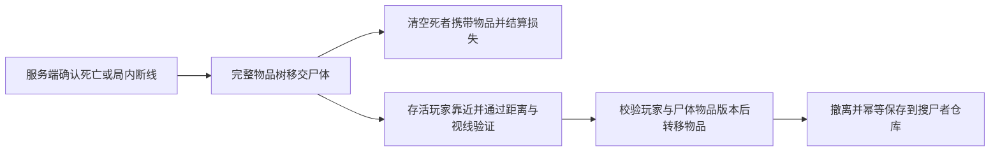

# 死亡掉落与搜尸

角色在月球局内死亡后，服务端在销毁可控制角色之前，将装备、口袋、胸挂、背包及嵌套物品移交给原地尸体。客户端用死者对应的角色模型播放 Mixamo `Rifle 8-Way Locomotion Pack/death from the front.fbx`，结束后保留倒地姿势。尸体是动画模型，暂不使用物理布娃娃。

靠近尸体按 **E**，左侧显示 `FALLEN EXPEDITION / GEAR`，右侧显示自己的口袋、胸挂和背包。支持拖动、旋转、拆分、合并、Ctrl 快速转移及双击打开内部容器。整体拿走背包会同时拿走其内部物品。

- 物品 ID、数量、入局来源标记、背包内布局保持不变；只重新排列原装备和口袋中的顶层物品。掉落网格最多 6×24，支持滚动；普通补给箱保持 6×5。
- 死者物品图只保留空根节点。结算界面的损失数量单独保留；物品不会返还死者。旧版本移动请求失效。
- 服务端处理死亡先于搜刮请求。死人、已结算玩家不能搜尸；每次转移继续检查存活、距离、视线和双版本。多人同时拿一件物品，后到的旧版本请求被拒绝。
- `RaidCorpseRpc` 同步落地位置、朝向、角色类型、死亡经过时间及是否搜空。新加入的连接可以收到已有尸体；旧版本状态不能覆盖新版本。已结束的死亡动画直接还原最终姿势。
- 尸体模型移除了控制、联网、碰撞和灯光组件，保留 `SecondaryBoneSpring` 供显式驱动头发。死亡动画不循环，身体结束后关闭 Animator 并释放 PlayableGraph；双马尾使用放松的回弹、重力、身体胶囊及地面约束，再模拟三秒后定格，关闭尸体 Update。不运行存活角色的裙摆、胸部、空中扰动逻辑。迟加入只预热有限的倒地／头发稳定时间，不模拟整段局内时间。
- 地图卸载时清理尸体。服务端根据落点法线同步尸体朝向；播放中以骨骼接触点避免穿地，身体末帧和头发定格时各烘焙一次网格，采样下表面修正接地高度。查询使用尸体所在的 PhysicsScene。当前不做关节贴合或物理滚落，凹凸复杂的地面可能仍有局部悬空。
- 个人物品图仍限制为 2048 节点；临时搜刮快照可合并两方节点，额外的世界根不会使满容量死亡物品图失效。传输片段仍为原来的 400 字符，未修改旧 RPC 布局。
- 局内断线按死亡掉落。重新出战不会复原掉落物；搜空的尸体继续留在地图。尸体及物品只存在于当前服务端 World，服务器退出后不保留；超时结算不生成尸体。
- 已生成 `Assets/Resources/Moonkov/CorpsePresentation.asset`、三个纯展示 Prefab 和非循环死亡动画；修改来源后可通过 `Tools/Moonkov/Build Corpse Presentation` 重新生成。模板角色使用单独的尸体 Humanoid Avatar，不修改其原控制器。

验证入口：`Tools/Moonkov/Check Death Bags` 检查物品归属、转移竞争、RPC 编解码及界面；`Tools/Moonkov/Check Corpse Presentation` 在临时 PreviewScene 检查三个模型的倒地、末帧保持、动画释放和迟加入还原，不启动 Play。此前数据库 `ContainerChecks` 的 75 项死亡／搜尸／撤离检查通过；尸体展示改动无需重复数据库检查。双客户端实际动画和交互由用户验收。
