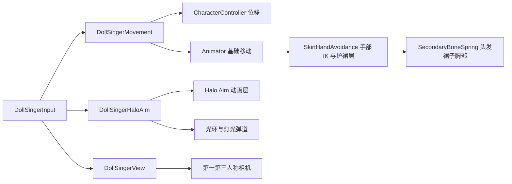

# DollSinger 本地角色迁移

入口：Unity 菜单 **Tools → Doll Singer → Open Demo**，然后点击 Play 并聚焦 Game 窗口。

- 场景：`Assets/DollSinger/Scenes/DollSingerDemo.unity`
- 可复用玩家预制体：`Assets/DollSinger/Prefabs/DollSingerPlayer.prefab`
- 所有新增 Unity 资产集中在 `Assets/DollSinger`。原有联机入口、Ghost、月球场景、包配置保持原状。
- 本次实现本地角色与演示场景；光环弹道沿用源项目的视觉演示，不造成伤害、不接入联机命中。

## 操作

| 输入 | 功能 |
| --- | --- |
| WASD | 移动；第三人称普通移动朝行进方向转身 |
| 鼠标 | 观察与瞄准方向 |
| Shift | 奔跑 |
| Space | 跳跃 |
| V / 鼠标中键 | 第一／第三人称切换 |
| 滚轮 | 第三人称距离 |
| 鼠标右键 | 手指枪瞄准，光环由头顶移向食指，第三人称切换肩后视角 |
| 瞄准时按住鼠标左键 | 连续发射独立激光视觉弹道，每发携带实时点光源 |
| 第一人称 Q / E | 从腰部带动上身左右侧倾，松开回正 |
| 第一人称 Alt + Q / E | 锁定探身；再次按相同组合解除 |
| 第一人称 Alt + 鼠标 | 自由观察；松开后视角回正 |
| L | 开关光环照明 |
| Esc | 释放鼠标，停止读取移动／瞄准输入 |
| F1 / 点击 Game | 重新捕获鼠标；捕获用的点击不会发射 |

手柄支持左摇杆移动、右摇杆观察、左摇杆按下奔跑、南键跳跃、左扳机瞄准、右扳机发射、右摇杆按下切换视角。

侧倾仅在第一人称生效。第三人称不接收 Q/E 或 Alt+Q/E 侧倾输入，身体和相机不倾斜；切到第三人称立即清除侧倾与锁定，再切回第一人称保持直立。

测试场景带有瞄准靶、探身掩体和逐级升高的平台，可观察跳跃、落地和空中护裙。

## 保留的源实现

来源是 MMORPG 当前的 `Src/Client/Assets/Resources/Character/Warrior.prefab`（DollSinger），以及对应模型、材质、控制器和运行脚本。保留 FBX、骨骼引用、13 个材质槽、原有光环线条与灯光、两条双马尾链、31 条内外裙链，以及胸部弹簧参数。

`SecondaryBoneSpring` 继续负责头发、裙子与胸部模拟；手／手指球体、躯干与腿部胶囊负责避让。`SkirtHandAvoidance` 通过 Animator IK 平滑调整手部，维持内外裙分离与空中护裙。离散动作仍由 `DollSingerThirdPersonHalo.controller` 的基础、`FreeFall Cover`、`Halo Aim` 层驱动。

护裙沿用源预制体配置：护裙手部额外 IK 权重为 0，由护裙动画控制手势；瞄准会按原逻辑降低护裙层权重。胸部参数以源预制体为准，没有套用原预览场景的局部调参覆盖。

移动使用源 ThirdPersonController 的本地逻辑，改名为 `DollSingerMovement`，解除 EntityController、InputManager、MapService 和协议依赖。位移由 CharacterController 管理，Animator root motion 关闭；物理模拟放在动画写入后的 LateUpdate。

第一人称保留身体、双马尾和完整角色影子，只对玩家自己的相机过滤面部及近眼头饰三角形。改用 URP 渲染回调，其他相机与 Scene 视图继续显示完整模型。模型开启 Read/Write，供运行时生成第一人称网格；运行时网格和影子对象随视角组件释放。

2026-10-03：探身只旋转腰部与胸部，不修改脊椎或其他骨骼的位置。上身沿关节弧线倾斜，眼位自然移向侧面；移除了强制平移上身到 0.22 米的方案。Movement 的 `m_BodyLeanAngle` 控制满侧倾的身体角度（默认 30°），75% 分配到腰部、25% 分配到胸部；`m_LeanAngle` 仍控制镜头倾斜角度。相机跟随眼位，瞄准偏移根据同一关节弧线计算，球形扫掠限制倾斜角度以避开掩体。左右 Alt 均支持自由转头；自由观察与回正期间暂停瞄准。极限低头时眼位平滑向胸部表面前方让开，可调整 View 上的 `firstPersonEyeForward` 和 `lookDownBodyClearance`。这轮按用户要求未运行测试或截图，最终手感与外观由实际 Play 确认。

## 目录和依赖

| 目录 | 内容 |
| --- | --- |
| `Art/Model` | DollSinger FBX 和原有 Humanoid 映射 |
| `Art/Materials`、`Art/Textures` | 角色与光环材质／贴图 |
| `Animation` | 专用控制器、手指枪／护裙／放松手指动画、遮罩及必要动画依赖 |
| `Runtime` | 输入、移动、视角、光环、模拟和手部避让；独立程序集 |
| `Editor` | 打开演示、向场景添加玩家和迁移资产清单；独立编辑器程序集 |
| `Prefabs`、`Scenes` | 玩家预制体与本地测试场景 |
| `Shaders`、`Demo` | URP 光环 Shader 与演示用 Bloom／场地材质 |

lilToon 使用 FPS_Template 已安装的包；不复制 Shader 包，也不修改包版本。能够按 GUID 复用的 Starter Assets 动画直接引用目标项目原有资源。原控制器存在一个丢失的旧 Fly 动画引用，迁移时改用现有 InAir 动画；本地控制不引入飞行玩法。

## 放进其他场景

将 `DollSingerPlayer.prefab` 拖入场景，或选择 **Tools → Doll Singer → Add Local Player to Current Scene**。该预制体包含一套相机和 AudioListener，作为场景中的本地玩家使用。整场景只保留一套激活的本地输入、主相机和 AudioListener，移走原测试玩家后再放置 DollSinger。正式联机 Ghost 需要单独适配，不能用本地预制体直接替代网络资源。

月球场景可复用已有 `MoonEnvironment.prefab`；先在月球出生点放置角色。若希望与月球重力一致，在玩家的 DollSingerMovement 上将 Gravity 设为 `-1.62`，并按需降低 Jump Height；本演示保留源角色的 `-15` 重力与 `1.2` 跳跃高度，以便比较原角色手感。

## 验收范围

本次已完成 Unity 脚本编译、必要资产与骨骼引用、缺失脚本和材质 Shader 检查。Editor 当前 MoonDemo 有未保存修改，因此未替换该场景或执行 Play Mode；运行时初始化、摆动幅度、手裙穿模和真实键鼠手感仍需要实际游玩验收。碰撞代理是骨骼级近似，不能保证任意动作下网格完全不相交。后续调整可直接在预制体上的 SecondaryBoneSpring、SkirtHandAvoidance、DollSingerView 与 DollSingerHaloAim 中完成。
