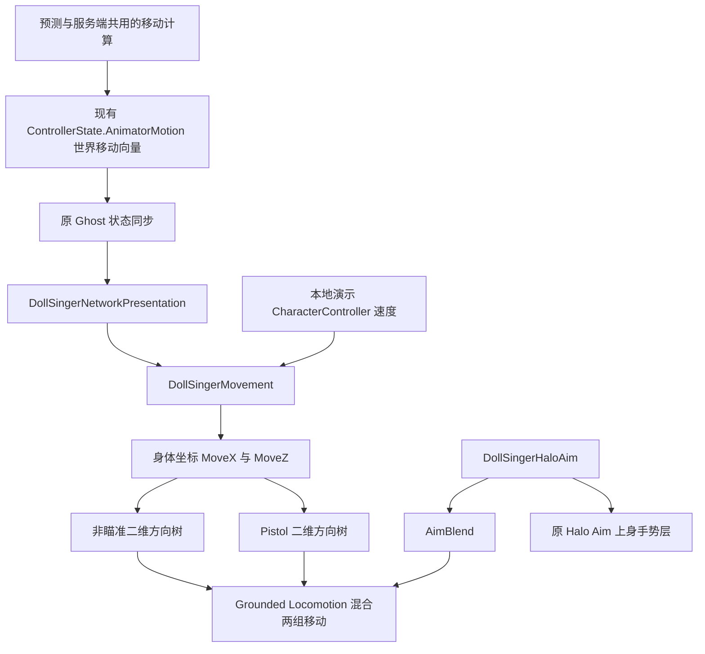

# DollSinger 方向移动动画

共享 Animator：`Assets/DollSinger/Animation/DollSingerThirdPersonHalo.controller`。本地演示和正式联机角色共用此控制器。

## 动作来源

| 状态 | 来源 |
|---|---|
| 非瞄准待机 | Mixamo / Locomotion Pack / idle |
| 非瞄准向前 Walk | 保留原 Starter Assets / Locomotion--Walk_N |
| 非瞄准向前 Run | 保留原 DollSinger_Run_N_RelaxedFingers |
| 非瞄准左右 Walk / Run | Locomotion Pack / left、right strafe walking 与 strafe |
| 非瞄准后退 Walk / Run | Locomotion Pack / walking、running 的反向循环；该包没有独立后退片段 |
| 瞄准待机、前进、后退、侧移 | Pistol_Handgun Locomotion Pack |
| 瞄准手部与手指 | 原 Halo Aim 层、DollSinger_FingerGunAim、原上身遮罩与手部 IK |
| 原地左右转身 | Locomotion Pack / left turn 90、right turn 90；仅覆盖腿部 |
| 跳跃、落地与空中护裙 | 保留原状态与 FreeFall Cover 层 |

Pistol 包只有一组左右侧移周期；走路使用原速，跑速节点复用片段并提高播放速度。现有正式联机逻辑会在瞄准时取消 Sprint。对角方向由四个方向的动作混合，不使用带累计转角的 arc 片段，避免动画自身转身与控制器转身叠加。

## 动画数据流

`MoveX` / `MoveZ` 使用角色身体坐标及平滑后的移动速度，向前为正 Z。树中的走速节点为 2，跑速节点为 6。第三人称非瞄准仍转向移动方向，所以转身结束后会使用原来的向前 Walk / Run；第一人称或瞄准时侧移、后退能使用方向动画。

移动方向复用已有网络字段 `ControllerState.AnimatorMotion`，没有新增 Ghost 结构字段或依赖远端键盘输入。瞄准移动树与原 Halo Aim 上身层由同一个 AimBlend 渐变驱动。

## 原地副本与编辑

新片段位于 `Assets/DollSinger/Animation/Locomotion/`，可直接编辑 `.anim`；原 Mixamo FBX 及其导入设置没有修改。工具复制 Humanoid 曲线并移除 RootT.x / z 中的累计平移趋势，保留步态摆动和垂直运动，避免网络控制器位移叠加动画中的髋部旅行。角色仍关闭 Apply Root Motion。

菜单 **Tools → Doll Singer → Set Up Mixamo Locomotion** 可重建移动树和原地副本，保留控制器及已有副本的 GUID；重建会覆盖这些副本的手动改动。该工具不重建角色预制体，不修改 Halo Aim、FreeFall Cover、原跳跃状态或前向 Walk / Run 资产。

最终动作观感、裙子与脚步效果由用户在 Play 中确认，不用自动截图验收。

## 原地转身脚步

`Turn In Place` 是腿部 Override 层，使用 `DollSinger_TurnLegs.mask` 排除 Root、身体、头、手臂和手指，同时启用左右腿及 LeftFootIK / RightFootIK。后两项保留 Humanoid 片段自带的脚部目标；若关闭，待机目标会把脚留在原处，即使转身片段的权重为 1 也看不到有效挪步。这里没有新增程序化脚部 IK。控制器继续负责身体旋转；转身动画只提供左右腿的挪步，不叠加动画自带的根旋转。原 Halo Aim 与空中护裙层保持原资源。

`DollSingerMovement` 比较相邻帧的身体 yaw，站立且速度低于 `m_TurnStationarySpeed`（默认 0.15 m/s）、转速达到 `m_TurnMinAngularSpeed`（默认 12 度/秒）时启动相应脚步，并随转速调整播放速度。停止转身后短暂保留并淡出；开始移动、离地或大角度瞬移时关闭。参数位于角色的 **Doll Singer Movement → Turn in place**。

联机角色取已有 `ControllerState.CurrentRotation`，本地角色取自身 Transform。只绕角色转动镜头不会触发挪步；第三人称非瞄准待机依然保持身体朝向，瞄准转身及第一人称身体跟随视线时会触发。没有新增网络字段或脚部 IK。

菜单 **Tools → Doll Singer → Set Up Turn In Place** 单独重建两个转身副本、腿部遮罩及转身层；完整的 **Set Up Mixamo Locomotion** 也包含此步骤。和移动副本一样，重建会覆盖相应生成资源的手动改动。

转身最小检查：编译后在独立预览场景驱动左右转身，确认正确片段、腿部动作及根朝向不受动画影响；静止、停止转身、移动、空中及瞬移时检查层权重。没有自动进入 Play，最终挪步观感待用户确认。

本次最小检查通过：Unity C# 编译；14 个副本均为 Humanoid 循环且水平 RootT 首尾无累计位移；独立预览场景中检查非瞄准／瞄准的待机、前后左右走跑及对角混合，共 16 个采样。原前向 Walk / Run 引用和 Halo Aim 片段保持原值。没有自动进入 Play 或运行联机端到端测试。
