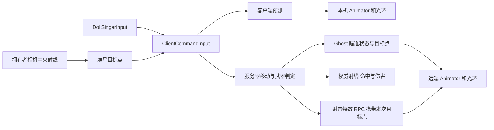
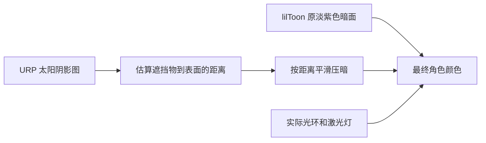

# DollSinger 联机角色

从 MainMenu 的 Choose Character 选择 **DollSinger**，再启动 Host 或连接已有服务器。正式入口使用 `DollSingerNetworkPlayer.prefab`；`DollSingerPlayer.prefab` 和本地演示场景仍用于独立调试外观。

## 控制与表现

| 输入 | 联机角色功能 |
| --- | --- |
| WASD / Shift / Space | 移动、奔跑、跳跃，沿用模板预测和服务器校正 |
| 鼠标右键 | 瞄准，服务器同步手势和光环位置 |
| 瞄准时按住鼠标左键／手柄右扳机 | 连续光环射击，服务器判断射速、命中、伤害和弹药 |
| R | 沿用模板装填逻辑 |
| V / 鼠标中键 / 滚轮 | 本地第一／第三人称切换与距离 |
| Q / E | 从腰部带动上身左右侧倾，松开回正 |
| Alt + Q / E | 锁定侧倾；再次按同侧解除，按另一侧切换 |
| 第一人称 Alt + 鼠标 | 身体和移动朝向保持，头部自由观察；松开 Alt 平滑回正 |
| L | 本地光环照明开关 |
| Esc / F1 | 释放／捕获鼠标 |

联机预制体关闭本地 `DollSingerMovement` 的位移模拟，并关闭嵌套 CharacterController。客户端保留 Movement 的 Animator IK 和 LateUpdate，用于转头和侧倾；根对象的模板控制器负责网络移动。`DollSingerNetworkPresentation` 把 Ghost 状态送入 Animator、头部、侧倾、护裙和光环表现。服务器不激活角色模型，相机和输入只属于本机玩家。第三人称观察者使用完整模型，第一人称隐藏面部仍只影响拥有者相机。

第一人称头部随视角 yaw／pitch 转动。自由观察保存独立的头部角度，不把 Alt+鼠标的转角送入身体转向和移动方向；自由观察及回正期间暂停瞄准和射击，回正后恢复右键瞄准。左右 Alt 都可使用。头部偏角和侧倾目标随输入命令进入预测及服务器状态，通过 ControllerState 同步给观察者，无逐帧 RPC。侧倾从腰部开始，再分配到胸部，腿部保持原动画；第一人称相机跟随倾斜后的真实眼睛位置，不再叠加旧版相机横移。锁定侧倾仍可用普通 Q/E 临时覆盖，松开恢复锁定侧。

低头时眼位在水平方向逐渐移到胸部表面前方，避开脖子和领口内部；俯仰限制为 ±80°。`DollSingerView.firstPersonEyeForward`（默认 0.045 米）和 `lookDownBodyClearance`（默认 0.20 米）可在 Inspector 调整。仅在拥有者相机使用第一人称网格，远端完整模型和影子保持原有路径。

第三人称未瞄准时，WASD 按相机水平朝向移动，角色平滑转向实际输入方向；例如 A 向左移动时身体也朝左，S 向后移动时身体转向后方。松开移动键后保持身体朝向，鼠标可独立绕角色观察。右键瞄准时身体朝向视角，允许侧移和后退；第一人称保持原有视角朝向控制。视角模式随输入命令送到服务器，身体朝向通过现有 ControllerState.CurrentRotation 同步，远端也能看到同样的转身。相机与光环目标仍使用独立的视角 yaw／pitch，避免把转身叠加到位移或瞄准方向上。

网络相机保存世界空间的视角旋转，并在 `DollSingerView.LateUpdate` 中、计算相机偏移和探身之前重新应用。这样角色父对象在预测／校正期间转身也不会把转角带进最终画面；准星射线采样使用同一视角接口。纯本地演示继续由原 Movement 驱动相机。

瞄准输入在服务器和客户端共同调用的移动累计入口处理。肩后相机先选中准星对应的场景目标；射击从网络预制体的稳定 `NetworkShotOrigin` 朝该目标发射。服务器重新做射线检测，客户端提供的目标点不代表命中结果。光环视觉弹道也朝同一目标收敛；掩体挡住角色发射点时，服务器会先命中掩体。

每发激光由 `HaloBoltPool` 独立保存起点、方向、速度、寿命及线段，第二发不会覆盖仍在飞行的第一发。飞完后关闭并复用效果对象；停用／销毁角色时清理飞行效果。每发配有跟随前端移动的实时点光源，默认强度 4、范围 3 米，不投射阴影；该灯独立于 L 控制的光环灯开关。月球 Renderer 使用 Forward+，地表材质已支持聚簇附加灯光，避免多个激光受到普通 Forward 每物体四盏灯的限制。

连续射击使用按住输入，服务端仍按照 `HaloWeapon.asset` 的冷却（当前 0.1 秒）、弹药与装填状态控制出弹，松开左键或退出瞄准停止请求。客户端激光只在 NetCode 首次完整预测 tick 生成，回放预测不会再次生成同一 tick 的光环激光；远端继续通过服务器特效 RPC 生成每发独立效果。飞行速度／长度／最大视觉距离及灯光参数可在本地角色预制体的 `DollSingerHaloAim` 上编辑。当前激光仍是 Hitscan 的飞行表现，没有更改服务端伤害为实体子弹碰撞。

## 资源和配置

- `Assets/DollSinger/Prefabs/DollSingerNetworkPlayer.prefab`：独立网络预制体，移除了旧模板第一人称手枪、第三人称模型与球形准星模型。
- `Assets/DollSinger/HaloWeapon.asset`：武器 ID 2，当前沿用模板 Hitscan 参数，无枪声与枪口火焰；光环飞行线段是视觉表现，伤害按服务器即时射线计算。
- `Assets/Scenes/GameResourcesSubScene.unity`：DollSinger 实体预制体和 Ghost 资源登记。
- `Assets/Editor/DollSingerNetworkSetup.cs`：菜单 **Tools → Doll Singer → Set Up Network Player**；登记工具可重复运行，已有网络预制体不会被整体重建。

模型、动画和头发／裙子弹簧仍可在本地预制体及其共享资源中编辑。网络移动参数在网络预制体的 `PredictedPlayerControllerConstsAuthoring` 上配置，本地 Movement 的参数不参与服务器模拟。

地面方向动画已接入 Mixamo：非瞄准使用 Locomotion Pack，保留原来的前向 Walk / Run；瞄准使用 Pistol 包的移动基础，手势继续由原 Halo Aim 层覆盖。方向来自现有 Ghost 移动向量，不依赖观察者输入；跳跃与护裙保持原状态。资源及编辑入口见 `Docs/DollSingerLocomotion.md`。

### 角色接收场景阴影

DollSinger_Body 的 SkinnedMeshRenderer 已启用 Receive Shadows，但 lilToon 还需要材质自身接收阴影。13 个共享角色材质的 `_ShadowReceive`、`_Shadow2ndReceive`、`_Shadow3rdReceive` 原为 0，现设为 1，允许地形、岩石及其他遮挡投影到角色上。Renderer 开关和材质开关缺一不可；材质中的 Shadow 设定可继续调整接收强度。角色继续使用 lilToon 和原贴图、分段阴影边界。

`_LightMinLimit` 保持 0，Outline Color 的 RGB 保持黑色，`_RimShadowMask` 为 1，`_OutlineLitShadowReceive` 为 1。不能用最低亮度保底来恢复脸部，否则无光环境也会亮。直接把三层 Shadow Color 永久设成黑色又会压黑阳光下的头发和脸部，因此共享材质已恢复原来的淡紫色暗面，运行时再按场景遮蔽调暗。

角色通过项目内 `MoonToonCutout` / `MoonToonCutoutOutline` 使用 lilToon 的扩展接口，复用原光照、贴图、描边和投影 Pass，不修改 PackageCache。按骨骼采样后切换整个材质的旧 `DollSingerSunShading` 已移除，避免整个材质突然变黑。

`MoonToonHooks.lilblock` 从 URP 太阳阴影图估算遮挡物到当前表面的距离，近处保留淡紫色自阴影，较远的遮挡逐像素压暗；实际光环和激光灯仍在之后叠加。

URP lilToon 默认在片元阶段先把局部灯光合并进主光照。直接把合并结果乘上太阳遮蔽，会同时压掉光环和其他玩家的灯；旧版本“附加灯之后叠加”的假设因此不成立。当前扩展对未烘焙的角色表面重新绑定 `LIL_GET_MAINLIGHT` 和 `LIL_GET_ADDITIONALLIGHT`：主光照只保留太阳，局部灯光独立写入 `fd.addLightColor`，由 lilToon 原 Forward Pass 在太阳阴影处理之后叠加。继续使用原有 URP 灯光循环及灯光层过滤，不区分灯的角色归属，不增加常亮保底。描边和烘焙光照分支不在本次调整范围内。

针对性离屏对照（黑色环境光、实际遮挡太阳、相同灯强度与相机）中，修正前关灯／头顶灯／前方灯的表面亮度均为 0；修正后依次为 0／0.85／0.768，无遮挡的日照亮度仍为 0.360，渲染错误为 0。这些数值验证灯光贡献与太阳阴影的分离，角色最终观感仍由用户在 Play 中确认。

材质 Inspector 的 **月球阴影遮蔽** 中，**开始压暗距离（米）** 默认 0.12，**完全压暗距离（米）** 默认 0.8。这是距离近似，不能可靠区分角色自身和场景遮挡。双马尾投到裙子和大腿上仍可能出现不规则深浅分层，暂保留该已知问题，后续另行解决。双马尾分布在 `DressDetail` 和 `InnerDress` 子网格中，仅修改 `Hair.mat` 不能控制全部双马尾投影。

曾尝试增加角色专用深度图识别投影来源；用户判定观感退步后已撤销这轮方案，移除组件、Renderer Feature 和相关接线，恢复到反馈双马尾异常时的距离近似版本。没有增加最低亮度保底或恒定自发光。

光环仍是实际局部光源，默认开启，三盏灯会照亮位于太阳阴影中的角色。按 **L** 关闭后才能判断无其他光源的黑暗表现；飞行中的激光点光源也会照亮附近角色。此次未关闭这些玩法光源。材质 Emission Color 当前为黑色，不是这次残余亮度的来源。

项目 `ProjectSettings/lilToonSetting.json` 的 `LIL_FEATURE_RECEIVE_SHADOW` 已为 true，无需修改包源码。实际双马尾自阴影和月球掩体投影的外观由用户在 Play 中确认；编译和资源接线检查不代表视觉验收。

## 当前范围

本次接入复用已有联机流程，保留 Rifle／Shotgun 作为对照角色。Q/E 侧倾和 Alt 自由观察已接入网络状态；侧倾属于骨骼与视角表现，服务器碰撞胶囊与发射锚点仍沿用原实现。L 灯光开关只影响当前客户端。弹药和装填仍是原型规则，后续可换为光环技能、能量或施法节奏。

2026-10-03 这轮按敏捷开发要求直接修改代码，没有运行测试、Play 冒烟、截图或视觉验收。操作手感、极限低头和联机观察者表现由用户实际游玩确认。

月球联机地图、最小撤离循环、独立持久化数据库不在这一角色接入范围内。先完成两端角色表现和射击对齐的验收，再接入月球出生点和撤离玩法。
