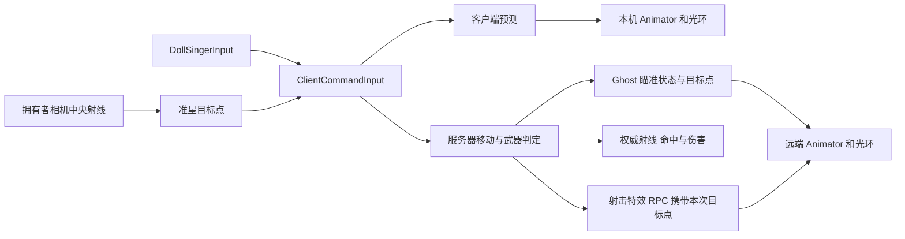

# DollSinger 联机角色

从 MainMenu 的 Choose Character 选择 **DollSinger**，再启动 Host 或连接已有服务器。正式入口使用 `DollSingerNetworkPlayer.prefab`；`DollSingerPlayer.prefab` 和本地演示场景仍用于独立调试外观。

## 控制与表现

| 输入 | 联机角色功能 |
| --- | --- |
| WASD / Shift / Space | 移动、奔跑、跳跃，沿用模板预测和服务器校正 |
| 鼠标右键 | 瞄准，服务器同步手势和光环位置 |
| 瞄准时鼠标左键 | 光环射击，服务器判断命中、伤害和弹药 |
| R | 沿用模板装填逻辑 |
| V / 鼠标中键 / 滚轮 | 本地第一／第三人称切换与距离 |
| L | 本地光环照明开关 |
| Esc / F1 | 释放／捕获鼠标 |

联机预制体关闭本地 `DollSingerMovement` 的位移模拟，并关闭嵌套 CharacterController。根对象的模板控制器负责网络移动；`DollSingerNetworkPresentation` 只把 Ghost 状态送入 Animator、护裙和光环表现。服务器不激活角色模型，相机和输入只属于本机玩家。第三人称观察者使用完整模型，第一人称隐藏面部仍只影响拥有者相机。

瞄准输入在服务器和客户端共同调用的移动累计入口处理。肩后相机先选中准星对应的场景目标；射击从网络预制体的稳定 `NetworkShotOrigin` 朝该目标发射。服务器重新做射线检测，客户端提供的目标点不代表命中结果。光环视觉弹道也朝同一目标收敛；掩体挡住角色发射点时，服务器会先命中掩体。

## 资源和配置

- `Assets/DollSinger/Prefabs/DollSingerNetworkPlayer.prefab`：独立网络预制体，移除了旧模板第一人称手枪、第三人称模型与球形准星模型。
- `Assets/DollSinger/HaloWeapon.asset`：武器 ID 2，当前沿用模板 Hitscan 参数，无枪声与枪口火焰；光环飞行线段是视觉表现，伤害按服务器即时射线计算。
- `Assets/Scenes/GameResourcesSubScene.unity`：DollSinger 实体预制体和 Ghost 资源登记。
- `Assets/Editor/DollSingerNetworkSetup.cs`：菜单 **Tools → Doll Singer → Set Up Network Player**；登记工具可重复运行，已有网络预制体不会被整体重建。

模型、动画和头发／裙子弹簧仍可在本地预制体及其共享资源中编辑。网络移动参数在网络预制体的 `PredictedPlayerControllerConstsAuthoring` 上配置，本地 Movement 的参数不参与服务器模拟。

## 当前范围

本次接入复用已有联机流程，保留 Rifle／Shotgun 作为对照角色。尚未接入 Q/E 探身和 Alt 自由观察的网络状态；L 灯光开关只影响当前客户端。弹药和装填仍是原型规则，后续可换为光环技能、能量或施法节奏。

月球联机地图、最小撤离循环、独立持久化数据库不在这一角色接入范围内。先完成两端角色表现和射击对齐的验收，再接入月球出生点和撤离玩法。
