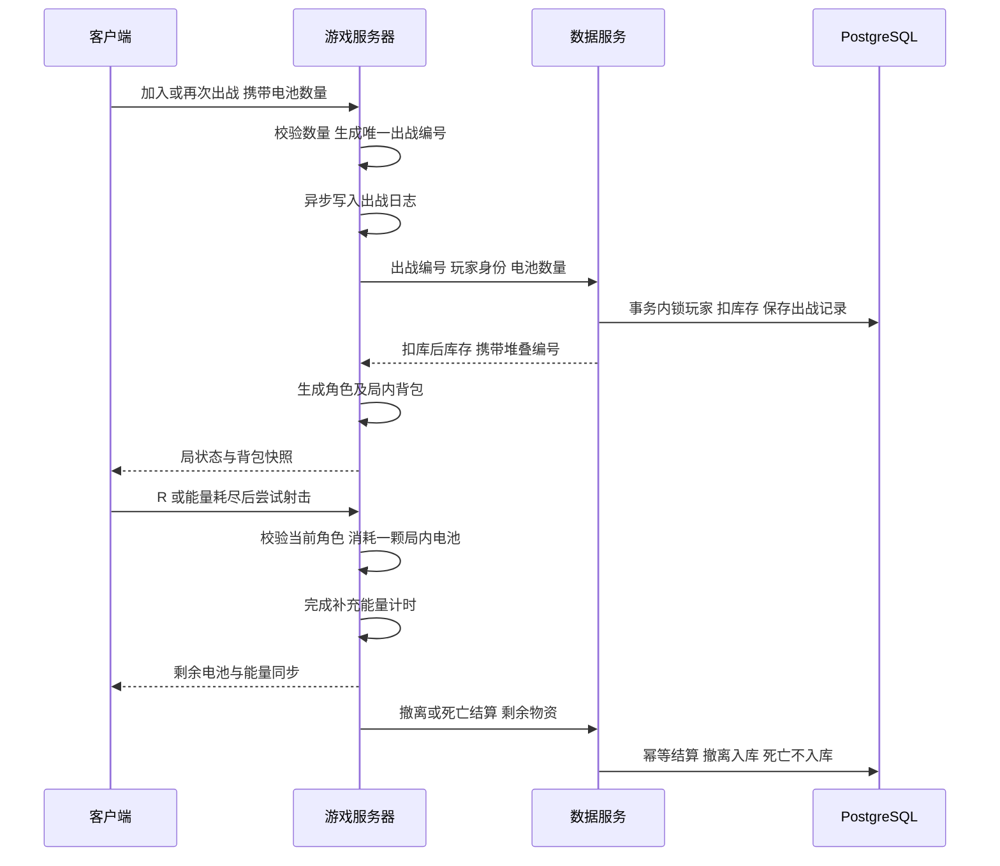

# 能量电池：库存、出战与局内消耗

服务端、数据库和客户端携带选择已接通。默认携带 0 颗，可在 OPERATIONS 的补给步骤、连接菜单或结算最后的 STORAGE 步骤输入携带数量。选择不会提前扣库，服务端接受出战后才扣除；局内拾取与携带的电池都能被光环消耗。

## 数据流



每次出战角色仍以满能量开始，光环当前容量 30 次射击。补充能量沿用 `HaloWeapon.asset` 的 2 秒计时；开始补充时立即消耗一颗局内电池，补充完成后充满。能量已经满时不耗电池；没有电池时不能补充。中途死亡也不会退还已使用的电池。模板 Rifle / Shotgun 和非撤离测试地图保留原行为。

携带数量允许 0–12，并计入现有背包的 12 个物资容量。携带 12 颗时需先消耗电池才能再拾取。出战后仓库立即减少携带数量；撤离只返回剩余电池与新拾取物资，死亡／超时／局内断线不会退款。旧的入库结算仍保持幂等。

## 数据库版本 3

| 表或视图 | 用途 |
|---|---|
| `item_definitions` | 月尘、合金、电池的类型、名称和格子尺寸 |
| `inventory_stacks` | 玩家仓库的持久 UUID、物品类型、数量、格子位置和旋转 |
| `stashes` | 从新库存计算三个旧数量的只读兼容视图 |
| `legacy_stashes_v2` | 迁移前的原仓库表，保留作历史数据 |
| `raid_deployments` | 唯一出战编号、原携带数量、携带堆叠编号与状态 |
| `raid_settlements.deployment_id` | 结算对应的出战记录，旧结算允许为空 |

当前每种资源在仓库中是一份数量堆叠，实例编号即使数量降为零也保留；数量没有在新旧表之间双写。拆分堆叠、多种装备、仓库容量与碰撞检查、持久化拖拽位置接口将在后续实现；本轮未把外观格子当作已实现的完整容器规则。局内仍沿用现有三种资源计数，电池堆叠另带服务端实例编号。

迁移在一个事务内完成。原三个资源数量和旧结算记录保留；初始化重复运行不会再次迁移。升级前已生成 `LocalData/backups/before-inventory-v3-*.dump` 备份。不要继续向 `legacy_stashes_v2` 写入新库存。

## UI 接入契约

携带数量由 `AccountClient.CarryCells` 保存为本次运行的菜单选择，限制为 0 到 `min(仓库电池, 12)`；登录新账号或退出账号会归零。首次加入和再次出战都发送该值。权威背包快照同时更新客户端仓库缓存，准备页确认步骤展示实际选择。Thin Client 默认不携带电池。

再次出战提交后立即锁定按钮；服务端等待期间也禁止重复提交和修改数量。`RaidDeployRpc.RequestId` 由 `RaidSnapshotRpc.LoadoutRequestId` 回显；只有对应当前请求的更新拒绝快照才能恢复操作并显示数量无效、库存不足或拒绝提示，上一次拒绝状态不能解锁新请求。此阶段仍只接通电池，装备槽和仓库格子移动没有变成真实出战装备。

- 首次加入：设置 `ClientJoinRequestRpc.CarryCells`。账号身份仍来自登录凭证，不能由客户端指定玩家 UUID。
- 再次出战：设置 `RaidDeployRpc.CarryCells`，继续携带当前 `SettledRaidId`。
- 数据服务 `/auth/me` 在原 `dust`、`alloy`、`cells` 字段之外返回 `items`，每项含 `id`、`itemCode`、`quantity`、`x`、`y`、`rotated`、`width`、`height`、`displayName`。
- 局内 `RaidSnapshotRpc.Cells` 是可用电池总量，`CellStackId` 是该局电池堆叠编号。
- `DeployPending` 为 true 时禁用重复出战提交；`LoadoutError` 区分数量无效、库存不足和拒绝。正式扣库以服务端结果为准，不能只信菜单缓存的仓库数量。
- 光环沿用现有 R 输入及空能量自动补充尝试，无需新增客户端“扣电池”请求。服务器才有权改背包数量和能量。

游戏服务器专用 API：`POST /internal/deployments` 与 `/internal/deployments/abandon`，请求含 `PlayerId`、`DeploymentId`、`Cells`。这些接口仍需要 `X-Moon-Server-Key`，不能让客户端直接调用。

## 重试与恢复

服务端在发起扣库前异步写入 `LocalData/raid-outbox/*.deploy`。失去 HTTP 回应时沿用同一出战编号重试，数据库不会重复扣库；确认前不生成角色。再次出战 RPC 在同一 tick 重复到达时，也只能排队一次。

服务器重启后，已有完整 `.json` 结算优先重放。仅剩 `.deploy` 时执行 abandon：数据库若已扣库，就将该局记为丢失；若尚未接受出战，就取消该编号而不新扣库存。断线时也会异步清理已接受的出战。结算成功后先删除 `.deploy`，再删除 `.json`，避免两次删除之间崩溃导致已撤离局被误判成死亡。不要手动清空未处理日志。

## 针对性验证

`Backend/InventoryChecks` 使用独立临时 PostgreSQL 数据库，覆盖旧库存迁移、重复初始化、堆叠编号保持、重复／冲突／并发扣库、库存不足、撤离仅入库一次、死亡不退款、未接受出战取消、已接受出战丢失，以及旧 outbox 结算兼容。测试结束自动删除该临时数据库，不修改项目真实库存。

```powershell
dotnet build Backend/InventoryChecks/InventoryChecks.csproj -o LocalData/inventorychecks
dotnet LocalData/inventorychecks/InventoryChecks.dll E:/UnityProjects/FPS_Template
```

真实数据库升级后，迁移前后各资源总量已核对一致，数据服务正常启动。ECS 规则对照确认携带两颗、使用一颗、撤离只带回一颗，拒绝重复出战、重复结算和扣库等待时的再次出战。界面已接线；两端实际出战及最终 HUD 表现由用户手动确认。

UI Agent 已完成，此前 `StashScreen.Equipment.cs` 的编译阻挡已解除，最新服务端 RPC 字段可正常加载。

客户端检查覆盖库存上限、12 格上限、负数归零、首次／再次出战的数量字段、库存更新后的选择收缩，以及 UXML 携带控件绑定。检查期间保留原账户缓存，未自动进入 Play 或修改真实库存。
