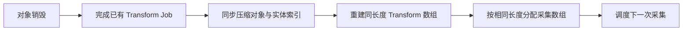

# Ghost 清理与 Transform 索引异常

2026-10-04，用户在移动修复后的 Host / Multiplayer Play Mode 测试中反馈明显改善，同时提供以下日志：

- `GhostEntityExists` 空引用：对象尚未 `LinkGhost`，其 World 为空，清理代码直接访问 World。
- `ServerRetrieveTransformsJob` 数组越界：例如索引 13、数组长度 7。对象列表清理后缩短，TransformAccessArray 仍保留旧长度；下一次采集按新对象数分配数组，却按旧 Transform 数调度。

原先清理还通过 `ghost.LinkedEntity` 重建实体列表，可能丢失等待绑定的对象身份；重建 TransformAccessArray 会跳过空对象，却不同时调整实体索引。

## 修复

清理使用生命周期系统已经登记的实体身份，保留等待绑定的对象；对象、实体、字典与 LocalGhostIndex 一起压缩。服务端采集排在物理更新与清理之后，防止同一帧的旧采集结果套用新索引。Transform 数组在调度前更新，服务端采集先更新数组再分配目的数组。修改这些集合之前完成相关 Transform Job，销毁时完成已知 Job。未绑定对象的 `GhostEntityExists` 返回 false。

## 验证

`Tools > Moonkov > Check Ghost Lifetime` 检查未绑定对象、等待绑定实体的保留、真实 Transform Job 启动后删除中间对象、清理后采集的数据和实体一致，以及删除全部对象后的空数组。`MoonkovBallisticsChecks.CheckPredictedLifetime` 检查预测子弹接管后的身份登记和清理。两项通过，Unity 编译通过；修复后的检查没有新增异常。

用户真实 Host / 虚拟玩家完整射击、死亡、退出流程尚需复测。移动问题已获得用户“好多了”的反馈，不能由此证明本轮生命周期异常在完整联机流程中全部消失。

## 日志中的其他信息

`Server Tick Batching` 是模拟性能警告：服务端合并 tick 以追赶进度；加载期间偶发与持续出现应分开判断，持续出现会降低输入、物理和预测质量。本轮未做性能测量。

`Account API did not become accessible` 来自 Unity AI Toolkit 的编辑器账号服务；日志没有证据表明它来自游戏自建账号后端。`NetCode RPC ... not been consumed` 需要进一步识别 RPC 类型与触发时机，当前日志没有类型信息。快照读取错误报告为可恢复，NetCode 会重置确认历史并重新发送快照；不能据此宣称频繁出现也无影响。
