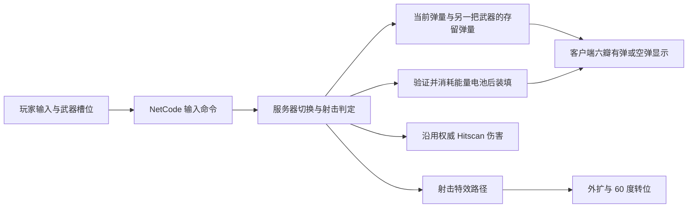

# 六发光环左轮

DollSinger 保留原有光环，新增第二把六发左轮。正式联机和本地 `DollSingerDemo` 均支持切换，沿用光环从头顶移向指尖的手势与瞄准流程。

| 操作 | 行为 |
| --- | --- |
| `1` | 切换原有连续射击光环 |
| `2` | 切换六发左轮 |
| 按住右键、单击左键 | 左轮单次射击；按住左键不会连发 |
| `R` | 手动装填；打空后自动请求装填 |

装填过程中不能切换；两把武器分别保留剩余弹量，切换不补弹。出生默认仍使用原光环，两把武器初始满弹。

美术来源：`E:/Download/Game Comp Test Space` 的 GameMaker 工程。只导入 `RevDot`、`RevClove`、`RevCloveAmmo` 的原始 PNG，保留 640×640 画布与中心原点；没有修改源工程。`RevolverHaloVisual` 保留原脚本的外扩、旋转设计，并将逐帧缓动换算为按时间计算的缓动；半径按后续紧凑要求调整。每次射击外扩、转位 60°，装填额外旋转一圈并转位，六瓣根据实际弹量切换贴图。

主要资源：

- `Assets/DollSinger/RevolverWeapon.asset`：注册 ID 3，6 发、0.75 秒射击间隔、0.75 秒装填、10 点伤害、100 米 Hitscan；这些数值是初始参数。
- `Assets/DollSinger/Prefabs/RevolverHalo.prefab`：中心与六瓣，挂在基础角色的 `haloVisual` 下，联机角色继承绑定。
- `Assets/DollSinger/Art/Revolver/RevolverGlow.mat`：使用现有 URP 光环着色器，保留原金色贴图。
- `Assets/DollSinger/Runtime/RevolverHaloVisual.cs`：仅负责视觉，不负责扣弹或伤害。
- `Assets/Scripts/Gameplay/Weapon/DollSingerWeapons.cs`：服务器与客户端预测共享的武器切换规则；只允许已有 DollSinger 武器在 ID 2/3 间切换。

正式 Moon Raid 沿用原光环装填规则：一次装填消耗一个可访问的能量电池；没有电池就不能补满。原武器 ID 2 的资源和弹量保持原配置。本地演示不接背包和服务端，左轮弹量只用于本地展示。

HUD 在左轮装备时显示 `REVOLVER / 剩余发数 / 6`。光环六瓣显示同一份网络弹量。切换输入和备用武器弹量增加了 NetCode 数据，服务器和所有客户端需要使用相同版本。

第一人称瞄准时，光环在自己的相机前方，中心沿最终相机中心线对齐准星，也随相机侧倾。相机到光环默认最多 0.45 米，并根据真实手臂长度缩短距离。光环位于右手大拇指尖正上方 0.035 米、前方 0.02 米；左手支撑位置向左、向下和向后移，让双手留在光环下方，给中央瞄准窗口留空间。手势保留原动画的手指形状，在身体侧倾与相机更新后调整手臂关节旋转，保持骨骼长度。第三人称继续以指尖为光环的瞄准锚点。

头顶光环缩放为 0.72，左轮六瓣待机半径进一步收到 0.06；瞄准使用 0.45 缩放和 0.10 半径，射击外扩半径为 0.16。六瓣在头顶和瞄准时都更紧凑。可在 `DollSingerHaloAim` 的 `Halo layout` 与 `RevolverHaloVisual` 调整尺寸、瞄准距离及拇指间隔。

第一人称保留手指模拟手枪的姿态，把大拇指尖放在光环中心正下方作为可见的瞄准参照。拇指与中心的间距由 0.10 米减至 0.035 米，射击手因此上抬约 6.5 厘米；支撑手保持在射击手左下方，避免双手堆叠遮挡中心。可通过 `firstPersonThumbClearance`、`firstPersonThumbDepth` 和 `firstPersonSupportOffset` 调整留白；这些偏移只应用于自己的第一人称视图。手部过渡、充能和回弹不驱动镜头或实际弹道，光环中心仍沿最终相机瞄准方向定位。

光环中心 `RevDot` 在瞄准时渐变到原尺寸的 8%，头顶状态保留原尺寸，可通过 `RevolverHaloVisual.aimedCentreScale` 和 `idleCentreScale` 调整。玩家屏幕准星只显示 2×2 像素小点；瞄准时隐藏模板的大十字准星。

左轮装填开始等待服务器确认，避免缺少能量电池时客户端自行进入装填、补满后又被服务器纠正为空弹。旋转表现使用 `LastShotTick` / `LastReloadTick` 去重，同一次装填的视觉进度只前进；旧装填状态不能覆盖后续射击转位，也不会把已完成装填的六瓣显示反复清空。

该修复已编译，并检查中心缩放、六次射击、装填进度回退、重复装填快照、补满后旧快照、装填后的连续单发转位及空弹静止状态。没有进行多人 Play 复现，最终打空行为仍需实际游玩验收。

最新拇指抬高调整已编译，并在临时离线战局中检查实际角色：拇指屏幕纵坐标由 0.252 提升至 0.414（中心为 0.5），射击手留在视野内；手部过渡不改变实际发射射线，回弹不移动光环中心或镜头，手臂长度保持不变。最终遮挡与手势观感仍需游玩验收。

已通过 Unity Editor 编译和针对性检查：原光环配置保留、切换保存弹量、重复切换与空弹切换不补弹、装填及死亡时拒绝切换、其他角色不能切入此武器组、六瓣在 6 至 0 发及补满时对应正确、两个角色预制体引用完整、着色器没有错误。

未进行 Play Mode 或双客户端实测。最终光环尺寸、发光强度、手势观感、实际射击及电池装填流程与双客户端同步需在 Unity Play 中验收。
