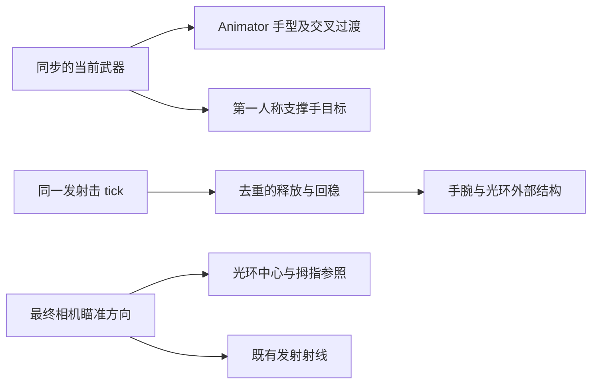

# 光环武器手势与回稳

四种武器共享最终相机瞄准方向和可见的拇指参照，手型与释放节奏各有区别。手势、切换、充能及回弹只负责表现，不驱动相机或实际弹道。

| 武器 | 手势 | 发射与回稳 | 默认转腕 / 后撤 |
|---|---|---|---|
| 步枪 | 原指枪姿态，支撑手留在左下方 | 短促回弹，连续射击有上限 | 5° / 0.016 m |
| 左轮 | 食指前指，其余三指收拢，拇指抬起；左手放低 | 单手转腕，六瓣外扩与转位 | 8° / 0.022 m |
| 霰弹 | 双手展开，手指略分开，像稳住能量团 | 双手一起后撤，释放更重、回稳稍慢 | 6° / 0.030 m |
| 狙击 | 食指、中指并拢前指，其余两指收拢；左手托稳 | 小幅释放，支撑手随后解锁、回位 | 3° / 0.014 m |

第一人称射击手以拇指尖靠近光环中心下方定位，支撑手按武器分开布置。拇指间距随相机视野缩小，避免六倍瞄准及切出狙击时手势落到画面外。支撑手位置和倍率平滑变化，手指形状由 Animator 进行 0.16 秒的交叉过渡；连续切换时在短过渡结束后进入最新目标，避免同一过渡反复打断自身。

三种单发武器的拇指默认间距为 0.022 m，手指略朝准心下方倾斜，让指枪、张掌、双指的轮廓可以区分。霰弹支撑手抬至射击手左侧，掌缘进入画面；狙击优先保留拇指参照和镜内留白。单发回弹限制拇指向上越过静止参照，避免转腕时闯入准心。步枪沿用既有 0.035 m 默认间距与手型。

充能期间优先表现支撑手动作：左轮接近转位区域，霰弹向外展开再收回，狙击保持原有反转扫动。射击回弹被充能状态压住，不与充能动作争抢手腕。单发反馈有上限，松开后自然衰减；切枪重置旧武器的回弹。预测效果、RPC 和快照使用同一射击 tick 去重。

## 编辑与接手

`Assets/DollSinger/Animation/DollSingerThirdPersonHalo.controller` 的 **Halo Aim** 层保留原 `FingerGunAim`，增加 `RevolverGesture`、`ShotgunGesture`、`SniperGesture`。整数参数 `HaloGesture` 由当前装备决定，不由动画决定装备或伤害。该层原有遮罩及瞄准权重继续生效，三种手型同时适用于远端角色的第三人称表现。

三个 `DollSinger_*Gesture.anim` 是可编辑的 Humanoid 动画；使用 Animation 窗口调整手指肌肉曲线。`HaloPoseTime` 默认固定为零，采样首帧；状态速度为一，让过渡时钟继续运行。默认动画来自原有指枪姿态，仅调整相关手指与左轮的支撑臂。

`Tools / Doll Singer / Create Missing Weapon Gestures` 仅补缺失动画、状态与过渡，保留已有手工调整。现有角色预制体使用同一控制器，无需重新安装武器或重建角色。

`DollSingerHaloAim` 的 **Weapon gestures** 可调三种支撑手偏移、拇指屏幕间距上限和支撑手平滑时间。手指过渡时长在 Animator 过渡中调整；`DollSingerView.weaponZoomTransitionSeconds` 调整切枪倍率的平滑时间。各武器的 `*HaloVisual` 可调 `Wrist Travel` 与 `Wrist Angle`；第一人称腕部旋转和双关节解算保持骨骼长度，第三人称沿既有手部 IK 加入小幅后撤。

本轮集中调整手型、第一人称可见位置、回弹与充能动作。伤害、散射、射速、倍率配置、音频素材及现有落点系统保持原配置。

## 定向验证

Unity 编译通过。Animator 检查确认三个状态能进入并结束过渡。在临时独立档案的离线战局中检查实际角色：左轮、霰弹、狙击拇指屏幕纵坐标分别约为 0.404、0.424、0.378（准心为 0.5），手腕回弹约为 0.0214、0.0307、0.0123 m。狙击最终视野约 13.31°，对应现有六倍配置。

检查覆盖射击后的拇指留白、镜头与光环中心不被回弹推动、手部过渡与充能不改变发射射线、手臂长度保持、快照/RPC 不重复启动同一发反馈、停火回稳与快速切回步枪。原生画面对比确认霰弹掌缘进入画面、三种武器中央瞄准区域留白。未进行双客户端验收或可执行程序构建；完整移动、侧倾与实战手感仍由实际游玩确认。
