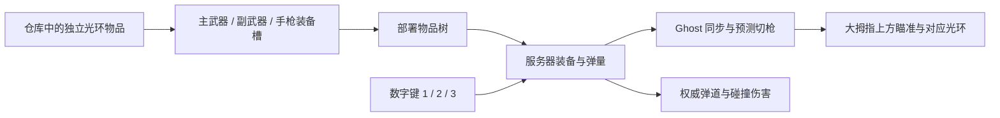

# 光环武器与装备

三种光环是独立库存物品，DollSinger 不再固定携带步枪和左轮。仓库中的光环需要拖入装备栏；背包内的武器不能直接切换。武器可收纳、交换、带入战局、掉落及撤离保存。卸下全部武器后角色不显示光环、不发射，移动照常。

| 物品代码 | 武器配置 | 占格 | 装备位置 | 初始弹仓 |
|---|---|---|---|---|
| `rifle` | `Assets/DollSinger/HaloWeapon.asset` | 2×2（4 格） | 主／副武器 | 30 |
| `compact` | 同步枪，兼容原库存代码 | 2×2（4 格） | 主／副武器 | 30 |
| `pistol` | `Assets/DollSinger/RevolverWeapon.asset` | 1×1（1 格） | 手枪 | 6 |
| `shotgun` | `Assets/DollSinger/ShotgunWeapon.asset` | 2×2（4 格） | 主／副武器 | 4 |

数字键 **1／2／3** 对应 **主武器／副武器／手枪**，不是固定绑定某种枪。右键瞄准，左键开火，R 装填，L 控制光环灯。切换保留每件武器的剩余弹量；收纳、重新装备和换槽都不会补满弹仓。服务器从真实物品树决定装备权限，客户端预测只使用服务器同步的装备槽。空槽不能选中。

新账号的三种武器放在仓库。旧账号第一次读取库存时，`WeaponKitVersion` 升级一次，只补齐缺少的三种武器到仓库，保留现有物品 ID、位置、弹量与资源。后续刷新、死亡或重新部署不会补发。非持久化测试战局有独立测试装备；本地角色演示的三个槽可在 `DollSingerHaloAim` 的 `localPrimary/localSecondary/localPistol` 配置，包括空槽。

霰弹枪接入 `E:\Code\Halos\Game Comp Test Space` 的 `ShotControl/Shotgun` 交付：四发弹仓、五张 `ShotShell` 弹量帧、四个 `ShotDot`、瞄准收拢、开火外扩、装填展开及逐步补齐显示。原图复制在 `Assets/DollSinger/Art/Shotgun`，均为 640×640，中心原点（320,320），每单位 1000 像素；GameMaker 的向下 Y 轴和角度已转换。瞄准位置沿用现有第一人称大拇指上方布局与小点准心。

当前初始平衡为四发、每次八枚弹丸、5° 半角散射、每枚伤害 10、冷却 0.8 秒、整仓装填 2 秒。以上都可在 `ShotgunWeapon.asset` 调整。散射使用输入 tick 的确定性图案，客户端预测与服务器一致；弹丸拥有各自的预测匹配编号，沿用现有重力、飞行、碰撞和伤害路径。一次发射消耗一发，整仓装填消耗一个可访问能源电池。八枚弹丸的灯光强度按单枚减小，避免每枪叠加八份照明。

库存图标在 `Assets/Resources/HaloIcons`，由实际 Sprite 像素和 LineRenderer 顶点生成原光环外形，不使用实体枪械图。重建入口：`Tools/Doll Singer/Import Shotgun And Weapon Icons`；配置与装备规则检查入口：`HaloWeaponSetup.Validate`。

已验证 Unity 编译、资源／注册表／预制体连接、占格、切槽、背包武器不可选、空手状态、每件武器弹量与确定性散射。`Backend/HaloWeaponChecks` 使用临时数据库验证旧库存升级、保留资源与已有物品、重复读取不补发、服务端装备配置持久化。第一人称实际遮挡、霰弹枪手感以及 Host/Client 表现仍需 Play Mode 验收。
