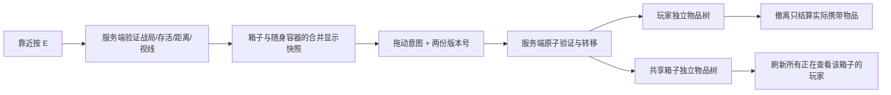

# 场景搜刮箱

月球正式联机地图已有物资点现在显示为测试搜刮箱。靠近按 E（手柄 X）打开，左侧是共享箱内物品，右侧是口袋、胸挂和背包。支持现有拖动、旋转、拆分、合并、整包移动及 Ctrl 点击快速转移。Tab/关闭/ESC 退出；等待物品确认时暂不关闭，避免关闭请求抢在转移请求之前处理。角色装备视图仍通过普通 Tab 打开。

每个服务器 World 为所有物资点初始化一次独立容器树，箱内物品具有唯一 ID。第一版由点位编号决定月尘、合金、电池数量，部分箱子包含小背包。箱子搜空仍可打开，也允许存入随身物品；关闭 UI、玩家重连或重新出战不会重置共享箱子。原来的定时自动刷新物资暂停；新服务器 World 生成新一批箱内物资。箱子模型目前为运行时测试模型，不是正式美术资源。

## 权威与一致性

- `RaidLootOpenRpc` 只请求开箱/关闭，服务器保存当前可访问的箱子；`RaidLootMoveRpc` 同时携带玩家版本、箱子版本及对应箱子编号。
- 开箱和转移都验证当前战局、角色存活、已打开的箱子、取物距离和 Default/Ground 遮挡。服务器周期复核，走远、失去视线、死亡或结算后关闭访问。
- `LootInventoryExchange` 在副本上执行现有容器规则；成功后一次替换双方物品树。失败不改任一方的版本或物品，保留 ID、数量、拾取标记和嵌套内容。两人用同一箱子旧版本拿同一件物品，只有先到的操作成功；后到的收到 Stale 和新快照。
- 联机 UI 的合并显示图带有 `loot` 根容器，玩家真实战局图不含该根。向账户持久化和撤离结算接口传入箱子图会被拒绝，避免误把整箱物品存入仓库。
- 快照复用 400 字符分片 RPC，额外封装箱子编号和版本；已有分片组件的内存布局未变。客户端与服务器须更新到同一版代码。旧即时拾取 RPC 不再生成物品。

## 检查与验收

`Tools > Moonkov > Check Loot Containers` 在 Edit 模式检查 24 个箱子初始图、双人同物品竞争、存入/拆分/合并、跨容器装备替换与嵌套内容、超重失败的原子回滚、箱子与结算隔离、分片元数据、实际生成的转移 RPC 以及 UI 双栏/快速转移请求。

后端 `ContainerChecks` 增加账户和结算拒绝 `loot` 根的检查，共 72 项通过；全部使用临时数据库，不修改正式资产。Unity 搜刮箱检查通过，后端编译通过并已重新启动。没有自动 Play、截图或自动 commit。

手动验收：

1. 进月球地图，靠近一个搜刮箱按 E；左右两侧均有标题、网格和物品。
2. 拖出一件物品并 Ctrl 点击存回；关闭再开箱，内容保持一致。Tab 查看随身背包。
3. 两个客户端打开同一个箱子，同时拿同一件物品；一个成功，另一个刷新，其他查看者同步看见变化。
4. 走远/被遮挡后确认界面关闭且不能继续取物；死亡和撤离同样结束访问。
5. 撤离后确认仓库只增加实际携带的物品；箱内剩余物品不进入结算。

搜索耗时、随机掉落表、美术开盖动画、死亡掉落包不属于这一轮。
