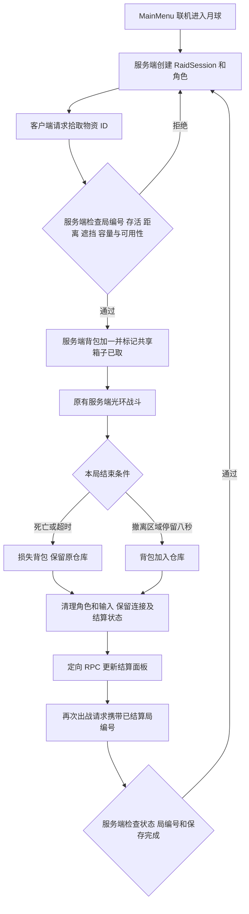

# 最小搜打撤闭环

正式地图为 `MoonGameScene`。从 MainMenu 注册／登录后选择 DollSinger，Start Host 或连接独立 Server 即可进入。月球场景新增 `Moon Raid` 配置对象，没有更换角色控制器或联机框架。

## 操作与规则

1. 出生区域向北有 12 个发光补给箱：蓝色月尘、橙色合金、紫色能量电池，每箱 1 个物资。靠近 3 米内按 **E**（手柄 X / West）拾取，背包容量 12。箱子是表现物，不挡移动或光环射线。
2. 沿用 DollSinger 的右键瞄准、左键光环攻击、R 装填；两名玩家可以互相攻击，血量和命中仍由原有服务端战斗系统判定。本步没有新增敌人 AI。
3. HUD 显示背包、剩余时间、绿色撤离信标的距离与东西南北方向。进入绿色区域并连续停留 **8 秒**撤离；离开区域或高度差超过 3 米立即重置计时。坐标轴 +Z 为北。
4. 撤离成功只结算一次，背包物资存入仓库。死亡或 **10 分钟**局内时间耗尽，背包物资丢失，已有仓库不受影响。结算面板保留本局携带数量，供核对带回／损失结果。
5. 点击 **DEPLOY AGAIN** 创建新角色、满血和默认光环弹药，开始新的个人出战，背包清空、仓库保留。此时仍在同一多人地图会话，其他玩家不被重置；被拿走的补给箱在 **60 秒**后刷新。

配置 `moon-server.local.json` 后，仓库属于账号并存入 **PostgreSQL**，断开连接、返回菜单或重启后可以恢复。撤离结算需要保存成功后才能再次部署；未配置数据服务时仍明确使用连接内存仓库。启动和数据流程见 [PostgreSQLPersistence.md](PostgreSQLPersistence.md)。暂未提供仓库取出装备、死亡掉落箱、交易、匹配与独立地图实例。

## 数据与职责

- `RaidData.cs`：局状态、数量、请求／快照协议与结算规则。
- `ServerGameSystem.Raid.cs`：拾取验证、全局箱子刷新、服务端撤离计时、超时、快照及再次出战。
- `ServerGameSystem.cs`：原有角色生成与死亡流程接入 RaidSession；更新再次生成角色的 JoinedClient 引用，避免操作已销毁的旧角色。
- `RaidClientSystem.cs`：收到服务端快照后更新该客户端 World 的状态。主机的服务端和客户端状态不共用静态背包。
- `MoonRaidMap.cs`：序列化补给／撤离坐标与参数，客户端生成发光标记；独立服务器不创建界面和标记。
- `RaidHUD.cs`：现有 UI Toolkit PanelSettings 上的局内背包、引导和结算界面，只提交意图，不自行修改仓库或判定撤离。
- `RespawnScreen.cs`：月球局停用模板五秒自动复活显示，保留无角色时的观察相机。

快照通过可靠、定向的 NetCode RPC 每 0.25 秒发送，包含自己的背包／仓库和共享箱子可用位图；后加入客户端也能看到当前箱子状态。快照序号单调递增，客户端忽略旧快照。请求携带局编号，已结束局的拾取、重复的再次出战请求不能污染下一局。结算状态在角色销毁前写入，重复结算不会重复发放。

## 地图配置

`Moon Raid` Inspector 可编辑 `Loot Positions`、`Extraction Position`、10 分钟局时长、8 秒撤离时间、5 米撤离半径和 60 秒补给刷新时间。最多 24 个箱子；箱子类型按数组索引循环分配三类，调整类型顺序时需要同时调整服务端规则与 HUD。

`Tools / Moon Environment / Set Up Minimum Raid` 用于缺少配置对象时创建默认点位，已有配置时不覆盖。设置脚本检查地形坡度和胶囊空间，生成 12 个补给点和 1 个撤离点。

## 最小手动验收

先单人拾取一个箱子，去绿色信标停留 8 秒，确认结算仓库增加，点击再次出战后背包归零、仓库保留。再用第二客户端造成死亡，确认本局物资丢失且不自动复活；两人争抢同一箱子应只有一人拿到。独立 Server 使用相同逻辑，无客户端 UI。

本步只做编译、场景配置及结算／重复请求规则的针对性检查；实际操作手感、完整联机战斗与界面外观交由用户在 Play 中验收，不自动运行反复 Play 或截图。

本次检查通过：Unity 编译；撤离仅入库一次；死亡／超时不入库；错误局编号与重复再次出战请求被拒绝；新局清空背包而保留仓库；隔离客户端 World 正确消费快照并拒绝旧序号；正式场景含 12 个补给坐标、撤离参数及有效 PanelSettings 引用。未启动自动 Play，完整两端实玩尚待上述手动验收。
