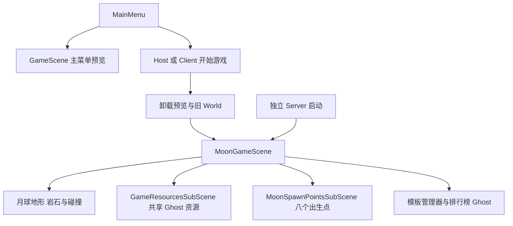

# Moon 正式联机地图

正式入口仍是 `Assets/Scenes/MainMenu.unity`。选择 DollSinger 后启动 Host 或连接独立服务器，游戏会加载 `Assets/MoonEnvironment/Scenes/MoonGameScene.unity`。

`MoonDemo.unity` 保留为本地地形和光照演示。正式地图复用其中的 Moon Environment 预制体实例、TerrainData、岩石布局、碰撞和 Moon Scene Lighting；移除了 Local Moon Explorer 及其相机，不复制测试角色控制器。

## 场景关系

`GameManager.GameSceneName` 指向 MoonGameScene，服务器和客户端使用同一加载入口。`MenuPreviewSceneName` 保留原 GameScene；菜单预览和正式地图顺序加载，避免两个场景同时注册同一份 GameResourcesSubScene，或让旧竞技场出生点混入月球。

## 出生和物理

出生点位于原演示出生位置 `(2048, 229.33, 1816)` 附近、512 米精细地形的南侧。创建时从月球碰撞向下采样，选择坡度不超过 30°、避开岩石且有角色胶囊空间的位置；最终登记 8 个 SpawnPointAuthoring，由服务器原有出生选择逻辑使用。

客户端新生角色的初始朝向改为使用服务器出生点旋转，解除对旧竞技场坐标 `(0, 0, -12)` 的依赖。地形和岩石碰撞在独立服务器也需要加载，用于移动和命中判定；月球地图本身是静态场景，不给每块岩石创建网络 Ghost。

本次保持角色现有移动、重力和跳跃参数。MoonDemo 的 Tab 地形切换及数字键光照对比属于演示工具，没有接入正式联机地图，以避免各端碰撞不一致。

## 编辑与运行

- 在 MoonGameScene 中编辑地图实例；从 MainMenu 进入游戏进行联机测试。
- 在 MoonSpawnPointsSubScene 中调整出生位置和旋转，并保证角色脚下有地形、周围有站立空间。
- 菜单 **Tools → Moon Environment → Set Up Network Map** 登记地图和出生子场景到 Build Settings。已有地图不会被重建。
- Editor 的 Client + Server 模式从主菜单启动 Host；Server 模式沿用 ServerBootstrap 自动启动流程，默认监听端口 7979。
- 独立客户端和服务器须使用包含新地图的同一版本；旧构建不会自动获得这些场景。

月球地图尚未添加拾取物、撤离区或持久化数据库。这些是下一轮最小搜打撤循环的工作。

## 验证

已通过 Unity 编译和场景引用检查：无本地演示相机，包含一套管理器生成入口和两个自动加载子场景；8 个出生点均能射线命中月球地形。原 MoonDemo 与共享月球资产没有重写。

Editor Server-only 已进入正式月球场景，服务器加载 8 个出生点、正常监听，且没有创建 ClientWorld；Host 已进入 InGame。按用户敏捷开发要求停止进一步自动测试，双端移动、攻击和实际画面由用户继续实测。没有验证独立构建产物。

画面、角色手感和最终游玩效果由用户在旁验收；不使用截图代替验收。
