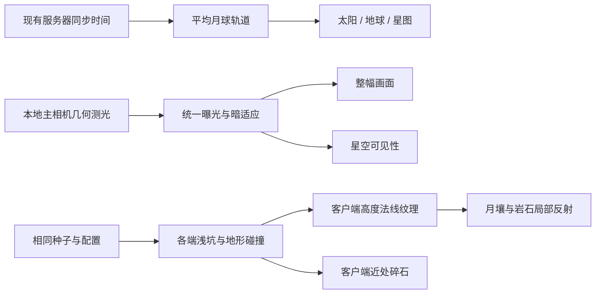

# 月球环境真实感配置

2026-10-10 远景条带调整：保留 35 米内已有材质对比，35–180 米平滑过渡到远景配色。远处大尺度噪声对比降到近处的 12%，不再按坡度连续染成深色带；坑缘抛射物保留较弱的局部明暗差异。裸岩贴图的额外颜色调制也随距离减弱，地形、岩石几何、法线、真实投影和曝光不变。三个材质新增 `Preserve Near Material Contrast To`、`Distant Material Blend Complete`、`Distant Macro Contrast Fraction` 调节项；本次未运行编译、测试或画面验收。

2026-10-09：本轮直接接入正式地图，按用户要求不运行编译、测试或 Play Mode。这里描述实现与近似范围，不表示已经完成视觉、性能或双端验收。

## 第二轮：正常视角可读的地貌与材质

根据“变化不大”的反馈，将重点转向画面中占面积最大的地表和中景轮廓。全图材质加入 17–113 米尺度的非周期明暗分区；坡面、裸岩和粉尘使用不同色调、颗粒尺度与法线强度。坑缘亮带、坑底暗区、放射状抛射物和碎石分布使用同一份 1024² 地质遮罩。新增 18 个中型坑候选、768 个小坑候选；前两个中型坑安排在出生点前方两侧，半径 13/19 米。源 DEM 和原有岩石资产仍保留。

上一轮整坑避让旧岩石容易使坑形消失；现在只保护原有岩石接触区，坑形在接触区外平滑恢复。出生区 23 米内不改变高度、23–31 米过渡，新增大岩块避开出生点 28 米范围。新岩块按坑缘分簇，目标最多 480 块、直径约 0.35–2.6 米，有 16 种不对称断裂轮廓、半埋过渡和逐块色差；采用三向投影避免拉伸表面纹理。

新增大岩块按 32 米空间块合并，包含 **各端一致的 MeshCollider**，不跟相机卸载；它们会实际改变移动与弹道遮挡。射击代码未修改，但服务端与客户端必须一起使用这版环境。小碎石仍无碰撞，候选密度提高，42–56 米渐隐。后处理 Contrast=8、Saturation=-8；未添加大气雾、虚构光束或满屏颗粒。

**材质分区可以在编辑状态下显示；新增坑形与岩块在进场时生成。若正在 Play 中，需退出并重新进入正式地图。旧可执行程序需重新构建才能包含代码与场景更新。** 本轮未运行这些操作或视觉验收，不以代码数量代替画面效果结论。

## 默认行为与接入

`MoonGameScene` 的 `MoonSceneLighting` 默认使用 `MeanLunarOrbit`，地点为 DEM 中心南纬 13.7855°、东经 25.164°，UTC 起点为 **2026-10-18 00:00**。该日期是可编辑的场景起点，不是读取玩家机器时间。`ApplyTimeOfDay` 继续接收现有服务器同步的游戏小时，RPC、HUD 和服务器时钟不变。

一个游戏小时默认对应一个天文地球小时，太阳日约为 29.53 个游戏日。HUD 显示的游戏小时不再等于当地太阳时。可调 `Astronomical Time Scale` 加快天空，或将 `Clock Mode` 改为 `GameplayDay` 恢复 24 游戏小时的日出日落。各端应使用相同的场景配置；这些配置没有新增运行时网络同步，发布时需各端一起更新。

天空以平均圆轨道、同步自转和零天平动近似计算，统一驱动太阳方向、地球明暗、地球自转与星图朝向。未接入 SPICE、精确轨道摄动、月轴倾角、食或实时云况；不能标为指定日期的精确天文复现。平均朔望月与参考新月来自 [NASA 月相资料](https://eclipse.gsfc.nasa.gov/phase/phases1901.html)（2000-01-06 18:14 UTC）。

太阳低空强度不再按地球式宽范围黄昏衰减，只在约 0.533° 太阳盘越过地平线时过渡。太阳与月面的既有遮挡仍由阴影图负责。默认夜间环境光为黑色；没有添加蓝色天空光。

## 曝光与星空

`MoonSceneLighting` 创建独立的运行时 Volume，通过 URP `ColorAdjustments.postExposure` 作用于整个画面。Default 层、Priority 20；不改原有 Profile 或角色相机。退出场景会销毁 Volume、Profile 和组件。

每 0.25 秒从主相机的五个视口位置采样可见几何及太阳遮挡，并补一个脚下采样，避免站在阳光下抬头就立即看见银河。暗处缓慢提高曝光，回到亮处快速降低；星空可见性跟随同一个适应状态。默认白昼星光系数 0，暗处星图基础强度 0.025，配合最高 +4 EV。Bloom 降至 0.35，Scatter 0.6。

这是几何测光近似，不是 GPU 亮度直方图，也不是物理相机校准。它不测量枪口闪光、手电等局部光源的实际屏幕亮度；`Maximum Exposure EV` 控制此近似的最大增益。完全没有光的地表不会因曝光而凭空发亮。当前未实现地照光。

| Inspector 参数 | 默认 | 作用 |
| --- | --- | --- |
| Adapt Exposure | 开 | 开关整幅画面曝光适应；关闭后回到原有曝光 |
| Maximum Exposure EV | 4 | 暗处最大曝光增益 |
| Dark Adaptation Seconds | 8 | 向暗处曝光的指数适应时间常数 |
| Bright Adaptation Seconds | 0.6 | 向亮处曝光的指数适应时间常数 |
| Exposure Occluders | Everything | 几何测光遮挡层，忽略 Trigger |
| Night Ambient | 黑色 | 可选美术填充，真实感预设关闭 |

## 有来源的局部反射光

`MoonSurfaceDetail` 在近场地形处理后生成一次 513×513 的高度/法线纹理，绑定到本环境的运行时材质副本。月壤和岩石像素采样周围四处地形，考虑光源方向、源与接收面的朝向、地形中点遮挡及当前太阳阴影图，近似单次漫反射。

此路径不使用全局环境补光。仅在近场纹理覆盖区且距相机 80 米内生效，50–80 米淡出；无贡献的方向跳过额外阴影采样。材质参数 `Local Terrain Bounce` 默认 1，`Average Source Terrain Reflectance` 默认 0.12。设强度 0 可以关闭。

这不是完整 GI：没有多次反弹、岩石/建筑到地面的反射源、建筑在反射路径中的完整遮挡或远场反射解算。URP 屏幕空间主光阴影变体无法采样任意反射源位置，因此关闭该变体的局部反射；当前月球管线使用级联阴影。额外纹理和阴影采样增加 GPU 成本，尚未测量性能。

## 月壤与近场地质

保留现有 LS/Lambert 混合、SHOE/CBOE 相位峰和 30° 参考相位归一化，没有伪称新增或拟合了完整 Hapke 模型。`Reflectance Calibration`（默认 0.8）为独立反射率倍率，未经当地实测拟合。第二轮颗粒法线为 0.8，细法线 0.24，近处视差高度 0.012 米。新增 `Landscape Material Contrast=0.8`、`Powder / Exposed Rock Separation=0.85`、`Metre-scale Fractured Surface=0.7`、浅色粉尘和暗色裸岩色调，均可在材质上手调。

环境 Prefab 的 `Runtime Near-field Geology / Surface Detail` 控制：

| 参数 | 默认 | 作用 |
| --- | --- | --- |
| Enabled | 开 | 开关近场浅坑、碎石与局部反射所需的地形数据 |
| Seed | 7319 | 确定性生成种子，各端保持一致 |
| Shallow Craters | 768 | 小坑候选数，陡坡会被跳过 |
| Landform Craters | 18 | 中型坑候选数，前两个位于出生区前方两侧 |
| Crater Depth Ratio | 0.15 | 相对于坑半径的中心深度，保护区内逐渐归零 |
| Fragments Per Tile | 420 | 每 12×12 米块的碎石候选数 |
| Tile Radius | 5 | 相机周围加载块半径，最多 11×11 块 |
| Largest Fragment | 0.22 m | 无碰撞碎石的尺寸上限 |
| Outcrop Rocks | 480 | 坑缘大岩块目标数，有实际碰撞，避让可能减少数量 |

小坑半径 0.8–5 米，中型坑半径 9–22 米，边缘有非对称破损；老坑边缘更钝，新坑边缘更窄、更突出。碎石在抛射区更密集，坡面减少。十六种不对称断裂轮廓配合旋转、缩放、半埋和局部反照率变化；每块合并成一个网格，每帧最多创建两块，42–56 米渐隐。空间索引避开现有岩石占地，不每帧遍历 6000 块岩石。

坑形在 **运行时 TerrainData 副本** 上生成并更新对应 TerrainCollider；服务端也生成相同几何。原始 DEM、近场 TerrainData 和 6000 块已摆放岩石不变。小碎石无碰撞，大岩块有碰撞；不改角色运动、弹道或命中反馈代码。无图形服务器跳过小碎石、纹理和 Renderer 创建，但保留大岩块碰撞。

参数在进场时读取；种子、坑数、日期等结构性改动需重新进入场景。退出时恢复原始 TerrainData，并销毁网格、纹理、运行时材质和 Volume。Demo 原有细节对比开关继续控制近场显示，光照对比开关继续切换月球反射/PBR。

## 交接边界

本轮只修改 `Assets/MoonEnvironment` 与月球文档；射击体验 agent 的角色、弹道、VFX、音效、HUD 及其他工作区改动均不属于本轮。按用户指示没有运行测试、编译、截图或进入 Play Mode，不宣称编译通过、画面达标、性能提升或多人验证通过。后续参数调整优先使用上述入口。
