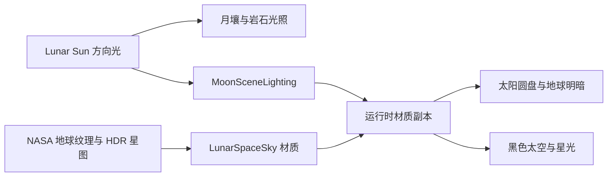

# 月球太空环境

正式联机地图 `Assets/MoonEnvironment/Scenes/MoonGameScene.unity` 已接入 `LunarSpaceSky.mat`。从 MainMenu 启动 Host / Client 即可看到；无需给角色增加相机或天空对象。MoonDemo 仍保留原来的光照对比设置。

## 当前效果

- 黑色、无大气散射的天空；没有蓝天、地平线雾或虚构星云。月球白昼的天空也应为黑色，参见 [NASA 月球介绍](https://www1.grc.nasa.gov/beginners-guide-to-aeronautics/moon/)。
- 太阳圆盘使用约 0.533° 视直径，方向从 Lunar Sun 的 `-transform.forward` 获取，编辑场景和运行时均保持同步。太阳遮挡由地形深度自然处理。HDR 圆盘与月球全局 Bloom 提供镜头眩光；这是显示效果，并非月球的大气散射或物理辐射单位。
- 地球使用 NASA Blue Marble 纹理，约 1.9° 视直径。球面法线与同一个太阳方向计算明暗，暗面遮住背景星星。薄蓝色边缘只属于地球；没有给月球天空增加大气。
- 星图使用 NASA 的真实恒星目录 HDR 图，包含银河，天空不随玩家平移，也没有随机闪烁。当前曝光按用户要求让日照中的恒星和银河可见；这是游戏显示取舍，未模拟白昼摄影曝光或人眼暗适应。
- 保留已有月壤、岩石、硬阴影和激光点光源。天空不向场景提供蓝色环境光，黑色阴影仍由现有光照策略决定。

## 调整入口

材质位置：`Assets/MoonEnvironment/Materials/LunarSpaceSky.mat`。

| 参数 | 用途 |
|---|---|
| Star map exposure | 恒星与银河整体曝光；默认 1.2 |
| Day star visibility | 日照星光比例；默认 0.65，设为 0 可得到白昼摄影中近乎纯黑的天空 |
| Star map yaw | 整张星图的水平朝向 |
| Earth direction in world space | 地球相对月球地面的方向，使用世界坐标 |
| Earth angular diameter | 地球视直径，默认 1.9°；增大会偏离当前比例 |
| Earth texture longitude | 地球朝向观察者的纹理经度 |
| Earth brightness | 地球显示亮度 |
| Sun angular diameter / Solar disk radiance | 太阳圆盘尺寸和 HDR 显示亮度 |

太阳位置改场景中的 Lunar Sun，而非手动编辑材质隐藏的 Sun direction。编辑模式在当前场景天空材质上更新派生的太阳方向，保留场景可序列化的原始材质引用；运行时 `MoonSceneLighting` 复制材质更新太阳参数，退出场景会销毁副本并恢复接管前的渲染设置，游戏不回写源材质。无图形设备的独立服务器跳过天空材质实例化。

眩光配置：`Assets/MoonEnvironment/Settings/MoonSpacePostProcessing.asset` 的 Bloom。场景 `Moon Space Volume` 位于 Default 层，与 DollSinger 相机的 Volume Mask 匹配；现有相机已启用 HDR 和后处理。MoonRenderer 引用 URP 官方 PostProcessData。默认 Bloom 强度 0.9、阈值 1.3、扩散 0.75，太阳圆盘 HDR 强度提高到约 80；没有更改方向光强度或对整幅画面增加曝光。

菜单 **Tools → Moon Environment → Set Up Space Sky** 可以创建缺失的天空材质，并连接正式地图；保留已存在材质的曝光、地球大小等参数。它会打开正式地图，调用前需保存其他场景的未保存编辑。

## 真实数据与近似范围

地形元数据 `Editor/Source/dem.json` 给出 Unity X 向东、Z 向北。根据投影与采样窗口，地形中心约为南纬 13.7855°、东经 25.164°；在同步自转、零天平动假设下，计算地球在本地天空的西北方向，仰角约 61.5°。位置固定，符合月球近侧地球不会像地球上的太阳一样每天横穿天空的基本关系。

当前没有选定观测日期，没有接入星历、月球天平动、地轴倾角、地球自转动画、真实时间的恒星朝向或昼夜循环。星图本身来自真实目录，但相对于此地点的整体朝向是固定的创作设置。地球纹理是多期观测拼接，不是该时刻的云况；地球表面北极朝向也使用简化的画面基底。不要将当前画面标注为某个日期的精确天文模拟。

## 验证与验收

已做针对性 Unity C# / Shader 编译与引用检查：正式地图天空绑定正确，两张纹理尺寸及格式正确；编辑模式下临时旋转光源，太阳圆盘方向仍一致，检查后恢复原旋转。Bloom 有效，Renderer 后处理资源、相机 HDR / 后处理及 Volume Mask 均已接通。没有自动进入 Play 或截图；实际地球位置、星光强度、地形遮挡和最终观感由用户在 Play 中确认。Scene View 可打开 Effects 中的 Skybox 与 Post Processing 来预览眩光。

后续场景构建可在此基础上安排登陆区、设施与撤离路线，继续沿用已有最小搜打撤循环。
