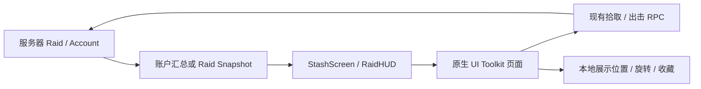

# Moonkov UI

本次根据规格实现游戏内 UI 的第一版，并按《明日方舟》《明日方舟：终末地》的参考方向收敛到浅灰底、深色文字、单一黄绿色出击重点、角色与单列菜单。主菜单角色使用项目现有 DollSinger 模型实时渲染。

## 使用

- 主菜单登录后进入飞船界面。顶部导航可切换角色/仓库、光环、供应商、行动、任务、基地、通讯、设置。
- 无需登录的独立预览：Unity 菜单 `Tools > Moonkov > UI Preview`。右上角标注 `PREVIEW / SAMPLE DATA`，预览数量不是账户资产。
- 配装预览：`Tools > Moonkov > Loadout Preview`。左侧实时角色，两列共六个装备槽：头盔、主武器、副武器、手枪、胸挂、背包。引导线投影自角色骨骼；配装时保持待机，首页仍随机播放动作。右侧使用完整宽度的 10×24 仓库，检查详情改为浮窗。
- 独立预览额外提供明确标注的七件示例装备。拖到兼容装备槽或点击槽位选择装备；Ctrl/Alt 点击优先装备到空槽；主、副武器可互换。拖回仓库可指定位置，拖拽期间 `R` 旋转、`Esc` 取消，靠近仓库上下边缘自动滚动。替换旧装备时优先放回腾出的格子，无空间则整个操作回退。不会生成第二份物品或调整数量。
- 独立预览仅在编辑模式运行；进入 Play 前自动释放预览角色，Play 中暂停预览与生成/检查工具，退出 Play 后恢复。避免独立预览和游戏菜单各创建一个运行时展示场景。
- 仓库：拖拽物资堆叠整理位置；`R` 旋转；绿色表示可放置，红色表示冲突/越界；失败返回原位置。右键可检查、锁定位置、收藏。双击或中键打开浮动检查窗口。窗口标题可拖动；`Esc` 逐层关闭。
- 出击：角色 → 地点 → 简报 → 回收合同 → 准备就绪 → 现有 Relay/Direct 联网终端。
- 战局：`Tab` 打开携带物资，`Tab`/`Esc` 关闭；`H` 按住查看状态与撤离方向。状态在拾取物品、低生命/低能源、时间紧迫时显示。设置中可选择常显。
- 结算：结果 → 本次物资 → 仓库。保存/重试期间禁止再次出击和返回飞船。

## 数据边界

账户界面当前接收月尘、合金、能源电池三种数量。项目另一项库存工作已提供三类资源的持久堆叠编号与电池出战契约，尚未提供上述六类装备及装备/仓库移动接口；本页面未冒充服务端完成换装。仓库位置、旋转、收藏和预览装备槽位仅在当前界面生命周期保留，不改资产数量。示例装备只在编辑器独立预览中加入，游戏账户界面不加入它们，也不替换角色身上的 3D 网格。资源不允许拖入装备槽。

光环节点、供应商、基地、任务简报、通讯与医疗窗口已提供 UI 布局和导航，但配件更换、交易、玩家市场、独立任务奖励、制作、保险、部位伤势与治疗尚未有后端服务，相关动作明确禁用。实际账户页没有伪造装备、货币、O₂、伤势或交易成功反馈。

局内格子展示真实 Snapshot 中的携带物资，打开时屏蔽移动/射击输入；不改变 Time.timeScale，也不暂停多人服务器。当前拾取仍采用现有 E 键拾取缓存的规则，未新增计时搜索、嵌套容器或服务端物品重排。

结算只展示服务器实际提供的结果、携带物资和账户仓库；XP、击杀报告与治疗步骤需要对应服务数据后再接入。

## 文件

- `Assets/UI Toolkit/GameUI/MainMenu.uxml`：登录、连接设置与飞船宿主。
- `StashScreen.uxml / .uss`：角色装备区、格子仓库及其布局。
- `MoonkovTerminal.uss`：简约菜单、页面和窗口主题。
- `Assets/Scripts/UI/Game/MoonkovTerminal.cs`：九个页面与出击步骤。
- `StashScreen.Interaction.cs / StashLayout.cs`：浮窗、菜单、跨区域拖拽、网格预览、滚动、位置校验与回退。
- `StashScreen.Equipment.cs / StashLoadout.cs`：六个装备槽、角色引导线、兼容性、换装/取下与事务回退；纯本地展示模型。
- `TerminalWindows.cs`：窗口顺序、焦点恢复与顶部 Esc 关闭。
- `Assets/Resources/Moonkov/RaidUI.uxml / .uss`：战局携带物资、撤离提示及三步结算。
- `Assets/Editor/MoonkovUIPreview.cs`：独立预览、展示预制体生成和针对性交互检查。

已删除之前生成的背景图和烘焙肖像。`MenuCharacterView.cs` 使用隔离舞台、独立摄像机与柔和补光实时渲染原模型；按显示尺寸以 2 倍分辨率绘制，最长边上限 2048，抗锯齿由当前管线与硬件共同决定。基础待机持续随机 6–11 秒，从 Halo Aim、左转和右转中随机选一个动作，避开上一次选择，再回到待机。Halo Aim 保持随机 2–4 秒；转身播放一次，并产生最多 18° 的对应朝向变化。默认过渡 0.65 秒，不应用根位移。Halo Aim 使用原上身 AvatarMask，转身使用原 Turn In Place 遮罩；动作列表不含 Pistol Idle。

展示预制体保留原 `SkirtHandAvoidance` 与 `SecondaryBoneSpring` 组件及其序列化引用。菜单开启 Playables IK，向手部避让传递菜单动画的时间步，并在动作求值后显式推进原裙子/头发/胸部弹簧及碰撞约束，避免常规 LateUpdate 再执行一次。游戏角色继续使用原有默认更新路径。脚本接入和引用检查不代表所有动作均已通过视觉穿模验收。

光环使用原预制体的线条与发光材质；待机时浮在头顶，瞄准时按原 `DollSingerHaloAim` 的轨迹移到指尖。摄像机在编辑器和运行时都限定只渲染自己的展示场景。隐藏菜单不创建展示角色，已有展示实例在隐藏或关闭时释放；销毁前立即停用，避免延迟销毁期间叠加。正常材质和阴影保留。

参数资产位于 `Assets/Resources/Moonkov/MenuCharacterSettings.asset`，可调整分辨率、角度、动作和间隔。`Tools > Moonkov > Rebuild Menu Character` 可重新生成只含展示组件的预制体；不会修改游戏角色的控制器、材质、输入或移动组件。切换展示页面或关闭界面时释放动画图、RenderTexture 和隔离场景，同时移除旧 Image 元素。

## 验证

配装针对性检查由 `Tools > Moonkov > Validate Loadout` 提供：装备兼容性、任意格子旋转放置、重叠回退、主副武器互换、锁定和满仓替换回退；实际 UI 指针事件覆盖装备入槽、错误槽位、拖回仓库、点击已装备槽选择和 Esc 取消，另检查六槽布局及页面切换后只有一个角色 Image。未重复全量动画或骨骼检查。

已通过 Unity 编译、UXML/USS 导入、九页构建、格子越界/重叠/旋转/锁定检查和 Esc 顶层窗口检查。没有为此重跑角色骨骼或月面渲染验证。

实时角色针对性检查通过：1200×1440 非空输出、8 次动作切换、可见光环与完整 Halo Aim 混合权重；展示场景只含一个角色，关闭后场景释放。外观和动画手感仍由用户验收。

重复实例复现检查通过：保持独立预览窗口打开并进入 Play，预览自动暂停；同时存在一个运行时展示实例时，菜单展示场景和角色总数均为一。更新后的预制体保留两项约束组件及引用，四个动作和对应遮罩已接入，编辑模式与 Play 模式的手动姿态求值均通过。未将此检查视为全部动作的视觉穿模验收。

最终画面与交互手感由用户在预览窗口和 Play 模式中确认。联网 Raid 内的开包、输入屏蔽、撤离与结算仍需实际战局验收；本次没有声称已完成联网端到端测试。
