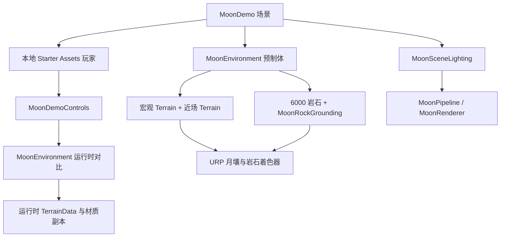

# 月球环境使用与集成

## 立即体验

1. 用 Unity **6000.5.10f1** 打开 FPS_Template。
2. 选择 **Tools → Moon Environment → Open Demo**，或直接打开 `Assets/MoonEnvironment/Scenes/MoonDemo.unity`。
3. 点击 Play，点一下 Game 窗口让它获得焦点。
4. 按 Esc 可以释放或重新锁定鼠标。

不需要再运行迁移脚本，也不需要访问 MMORPG 的目录、启动服务器、重新下载地形数据或安装新的包。

| 操作 | 按键 |
| --- | --- |
| 行走、观察 | WASD、鼠标 |
| 奔跑、跳跃 | Shift、Space |
| 释放／锁定鼠标 | Esc |
| 原始 DEM 与近场细节对比 | Tab |
| 太阳高度角 0.5°／25°／60° | 1／2／3 |
| 月球反射与 URP Standard PBR 对比 | 4 |
| 回到出生点 | R |

演示的重力为 **1.62 m/s²**，仅作用于它自己的 Starter Assets 控制器。它是本地环境演示，未包含枪械、联机角色或 MMORPG 的第三人称角色。

## 迁移内容

| 成果 | 位置与用途 |
| --- | --- |
| LROC Theophilus3 真实 DEM | `Terrain/ObservedTerrain.asset`：4096 × 4096 m 的宏观地形 |
| 近场重建 | `Terrain/DetailedTerrain.asset`：中央 512 × 512 m，0.25 m 网格，保留小陨坑和粗糙地表 |
| 岩石分布 | 环境预制体完整保留源场景的 6000 个实例、缩放、旋转、碰撞、接地平面与新鲜度 |
| 月壤细节 | 随机三角晶格采样、细颗粒法线、近距离视差、宏观变化、地质遮罩 |
| 岩石细节 | 扫描贴图、颜色变化、风化色调、地面尘土混合 |
| 月球反射 | 源场景的 Lunar-Lambert / Lommel-Seeliger 混合盘函数、SHOE/CBOE 相位峰及太阳盘平均 |
| 低角度阴影处理 | 两块地形使用 TwoSided，月壤 ShadowCaster 使用 Cull Off |

这次迁移保持了源场景当前的 `_LunarWeight=0.55` 和相位参数，没有把早先提出但未落地的纯 LS／四个 `_Surge*` 控件设计混入迁移。URP 与 Built-in 的亮度和阴影实现有差异，最终观感由实际游玩判断。

## 目录规则

所有月球资源都在 `Assets/MoonEnvironment`，没有散落到模板的 `Scripts`、`Scenes` 或原有配置目录。

| 目录 | 职责 |
| --- | --- |
| `Art/Models`、`Art/Textures` | 两套岩石模型、被材质实际引用的扫描贴图、地质遮罩 |
| `Materials`、`Shaders` | 三个材质、URP 着色器与共享 HLSL |
| `Terrain` | 原始 TerrainData 资产 |
| `Runtime` | 环境对比、接地属性、可选场景照明；独立运行时程序集 |
| `Demo` | 本地第一人称演示控制；单独依赖已有 Starter Assets 和 Input System |
| `Prefabs`、`Scenes` | 可复用环境和轻量演示入口 |
| `Settings` | 模块自己的 URP Pipeline 与 Renderer |
| `Editor` | 添加环境／打开演示／首次生成工具；编辑器程序集 |
| `Editor/Source` | DEM 元数据与高度数据、精确摆放配方、来源文件列表和迁移校验值 |

`Editor/Source` 是溯源与重建资料，不由运行时组件加载。进入 Play 时也不会生成地形或重新摆放岩石。

## 组件如何协作

- **MoonEnvironment** 持有明确序列化引用。启动后复制远景 TerrainData 和三个材质，Tab／4 操作只改变副本。近场 TerrainData 仅被读取。
- **MoonRockGrounding** 在启用时恢复每块岩石的 MaterialPropertyBlock；不会每帧查询地形或创建材质。
- **MoonSceneLighting** 是演示场景的独立对象。运行时临时选用 MoonPipeline、关闭天空填充与雾，并在禁用时恢复之前的照明和管线引用。
- **MoonDemoControls** 只处理演示快捷键，移动仍由已有 Starter Assets 负责。

编辑模式使用模板原来的 PC_RPAsset／Forward+，运行演示时使用 MoonPipeline／Forward。月壤与岩石 Shader 同时支持两种光照路径，因此未点击 Play 时也可以由 Lunar Sun 正常照亮；不需要为了预览修改全局 Pipeline。

不要把 `MoonSceneLighting` 放到多个同时加载的场景里。一个活动世界只保留一套场景照明所有者；它切换的是整个活动世界的管线。

## 在自己的场景使用

1. 打开目标场景，选择 **Tools → Moon Environment → Add Environment to Current Scene**。也可以拖入 `Prefabs/MoonEnvironment.prefab`。
2. 保持环境根节点的位置 `(0,0,0)`、旋转 `(0,0,0)`、缩放 `(1,1,1)`。源地质遮罩和岩石接地平面使用世界坐标，当前版本不支持任意整体旋转／缩放。
3. 移除目标场景中重复的天空、雾、太阳和其他照明对象，按目标场景需要配置。预制体自带太阳，但场景照明与 Pipeline 切换是单独的选择。
4. 将自己的角色放在预制体的 **Spawn Point**。环境的原点在地形角落，出生点约为 X=2048、Z=1816，Y 取实际地形高度。
5. 保留 TerrainCollider 和岩石 MeshCollider，确保玩家地面检测 LayerMask 包含它们所在的 Default 层。

仅使用环境预制体不会自动切换项目管线。若需要演示的月球照明，可复制 MoonDemo 的 **Moon Scene Lighting** 对象，重新指向目标环境的太阳；其 Pipeline 指向 `Settings/MoonPipeline.asset`。若已有复杂场景照明，应把月球参数整合到已有所有者中。

### 接入模板联机地图

模板从 MainMenu 通过 `GameManager`／`ScenesLoader` 加载 GameScene，本次交付保留这个流程。

把环境放进 **GameScene** 或你自己的地图加载路径，然后迁移出生点到可行走区域。环境是静态场景对象，不需要为 6000 块岩石注册 Ghost。服务器与客户端必须加载一致的地形和岩石碰撞。正式联网地图不要挂 `MoonDemoControls`，也不要让客户端单独切换 DEM／近场碰撞；太阳或地表状态如需联机改变，应由现有网络权限流程同步。

完整替换联机地图还涉及出生点、资源子场景和原有地图对象，当前环境迁移没有自动修改这些游戏配置。演示的 1.62 m/s² 不会自动应用到网络角色。

## 常用参数

| 位置 | 控件 | 作用 |
| --- | --- | --- |
| `LunarRegolith.mat` | `_Color`、`_DetailStrength` | 月壤反照率与合成细节 |
| 月壤／岩石材质 | `_LunarWeight` | Lambert 与 LS 混合；迁移值 0.55 |
| 月壤／岩石材质 | `_PhaseEnabled`、`_PhaseSlope` | 相位开关与宽角度衰减 |
| 月壤／岩石材质 | `_ShadowHidingAmplitude/Width` | 阴影遮蔽峰；Width 单位为度，非 FWHM |
| 月壤／岩石材质 | `_CoherentAmplitude/Width` | 相干后向散射峰 |
| 月壤／岩石材质 | `_IndirectStrength` | 间接光贡献，默认 0 |
| `MoonPipeline.asset` | Shadow Distance、Cascades、Resolution | 1800 m／4 级联／8192 的演示阴影预算 |
| 演示玩家 | Gravity、MoveSpeed、SprintSpeed | 独立本地运动参数 |

调整共享材质会改变所有使用它的场景；需要不同风格时复制材质再分配。运行时对比副本会在对象销毁时释放。

## 使用边界与排错

- **材质粉色**：确认活动管线为 URP，检查 Console 的 shader 错误。不能在 Built-in 或 HDRP 直接使用此模块的 URP 着色器。
- **远景发黑或看不到环境**：确认自己的镜头放在 Spawn Point 附近，Far Clip 足够大；默认场景不会提供天空环境光，背阳面黑暗是配置结果。
- **近远地形重叠**：远景 TerrainData 的中心孔洞应与近景匹配。不要只关闭近景而保留远景孔洞；演示提供配套的 `SetDetailed`。
- **阴影消失／低角度漏光**：运行演示时使用独立 MoonPipeline，检查太阳开启阴影以及两块 Terrain 的 TwoSided。迁移保留修复措施，但不声称 URP 的每个角度与源管线像素完全一致。
- **地形显示错位**：保留 `Terrain.drawInstanced=false`。当前自定义顶点路径使用非实例化 Terrain 网格，不支持勾选 Draw Instanced。
- **性能压力**：保留了 6000 个源岩石实例与网格碰撞；当前版本未做 LOD／合批优化或性能认证。可先降低模块自身 Pipeline 的阴影分辨率／距离，再按具体瓶颈优化。原始 3 m DEM 与重建地形仍可单独使用。
- **构建**：MoonDemo 未加入默认 Build Settings。要构建独立演示，把它加入自己的 Build Profile 并设为入口；不要在模板原有联机流程中直接替换 MainMenu。
- **首次生成菜单**：仅在预制体与演示场景都不存在时使用，从模块内的布局配方生成；已有文件会被保护，不会覆盖手工修改。通常只需 Open Demo 和 Add Environment。

## 移除或回退

先移除自己场景中的月球实例及照明对象，再删除 `Assets/MoonEnvironment` 和对应 `.meta`。默认模板场景、包和项目配置没有迁移修改，无需恢复它们。若将 MoonDemo 加进了自己的 Build Profile，移除该入口引用即可。
