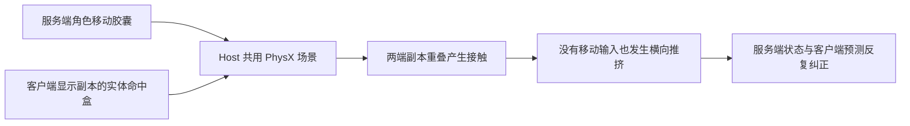

# Host 移动抖动与加入者漂移

调查日期：2026-10-04。Unity 6000.5.10f1，NetCode for Entities 6.5.0。

用户复现场景：主 Editor 开 Host，Multiplayer Play Mode 虚拟玩家加入。主机移动抖动，加入者没有移动输入也会漂移；独立程序组合尚未测试。修复后用户复测反馈“不错好多了”；随后提供的 Ghost 清理异常另见 `GhostLifecycleRegression.md`。

## 已复现的机制

GhostBridge 把服务端和客户端 GameObject 放在同一 PhysX 场景。`ServerPlayer` 和 `ClientPlayer` 默认允许互相碰撞，角色移动控制器此前没有排除另一端的层。

射击功能新增的 `Head hitbox` / `Body hitbox` 是实体碰撞体。客户端代理的移动控制器虽然被禁用，身体命中盒仍然存在。当它与服务端同一角色的移动胶囊重叠时，胶囊会被显示副本挤开。两份副本的位置分别来自服务端模拟和客户端预测／插值，不能把这种接触当作真实玩家碰撞。

隔离实验让两份副本相差 0.03 米，仅给移动胶囊向下的位移：30 次移动产生约 0.61 米横向推挤；排除另一端的玩家层后横向位移归零。自身子物体身体命中盒的实验没有复现这个横向推挤，不能把它单独认定为原因。

## 修复

- `PlayerGhost.OnGhostLinked` 为移动控制器追加另一端玩家层的 `excludeLayers`：服务端排除 `ClientPlayer`，客户端排除 `ServerPlayer`。保留原有排除层、同端角色碰撞以及地面／墙体碰撞。头部和身体命中盒仍然可被射击查询命中。
- `PlayerPredictionSystem` 的移动应用阶段补上 `Simulate` 过滤，与输入模拟阶段一致。关闭此标签的实体不再因残留的 `RequestApplyMovement` 被移动。这是独立的预测正确性修复，尚未证明它是本次反馈的主要触发点。参考 [Unity 预测文档](https://docs.unity.cn/Packages/com.unity.netcode@1.4/manual/prediction.html)。

## 验证与边界

`Tools > Moonkov > Check Network Movement` 使用实际网络角色预制体和角色初始化逻辑，先取消碰撞排除以复现推挤，再验证修复后的服务端／客户端两个方向、身体射击查询、墙体阻挡，以及不参与当前 tick 的实体保持原样。`Tools > Moonkov > Check Head Shots` 验证头部命中、自身过滤、墙体遮挡和代理瞄准。两项检查已通过，Unity 编译通过。

这些是受控物理与 ECS 回归，未替代真实 Host 加虚拟玩家的联机验收。旧 Play 日志存在 `Server Tick Batching` 警告，表示服务端曾跟不上目标模拟频率；本轮没有做性能测量，不能宣称已消除所有帧耗时问题。

实际验收：Host 与虚拟玩家均进入地图后，双方静止 10 秒，再各自走动、停止，确认无持续横向漂移或周期性拉回；随后确认头部射击与死亡后的尸体／搜尸流程。若仍有问题，记录发生时的 Frame、RTT、Snapshot gap，以及哪个视角出现拉回，再针对剩余现象定位。
