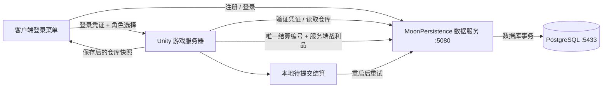
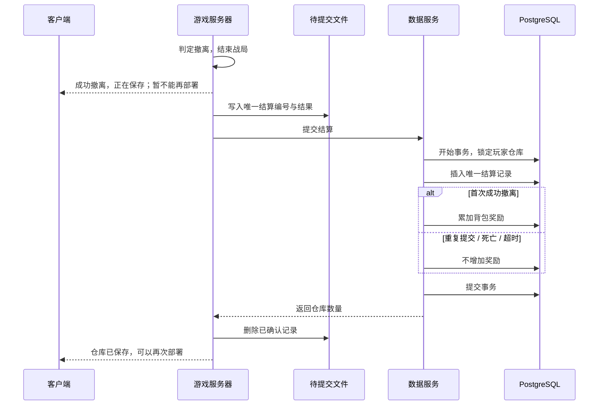

# 账号、PostgreSQL 与战局结算

本轮实现用户名注册、密码登录、退出登录、账号仓库和服务端结算持久化。游戏服务器仍负责拾取、死亡和撤离判定；数据库保存结果。

版本 3 已将仓库迁移为物品堆叠，并加入出战携带电池的扣库与恢复流程；原 `stashes` 现在是兼容读取视图。新表、RPC 和 UI 接入说明见 [EnergyCellLoadout.md](EnergyCellLoadout.md)。

## 三个进程的关系



- **Unity 游戏服务器**：现有 NetCode Server World，裁决实时游戏。异步任务只处理数据，不在工作线程操作 ECS 或 Unity 对象。
- **MoonPersistence**：独立 ASP.NET Core / .NET 10 程序，通过 Npgsql 连接数据库。客户端使用 `/auth/*`；游戏服务器用专用密钥调用 `/internal/*`。
- **PostgreSQL**：保存账号、凭证哈希、仓库和结算记录。停止游戏或数据服务不会清空已经提交的数据。

电脑原有 `postgresql-x64-18` 服务位于 `D:\PostgreSQL\18`，本次没有修改它。项目使用该目录中的程序，单独创建 `LocalData/postgresql` 数据目录，监听 `127.0.0.1:5433`，没有注册 Windows 服务。

## 本机使用

首次配置已完成；数据库和数据服务已在后台运行。下次从项目根目录启动：

```powershell
powershell -NoProfile -ExecutionPolicy Bypass -File Backend/Start-Backend.ps1 -Background
```

它会启动项目数据库和数据服务，识别并保留已经运行的服务。去掉 `-Background` 可以前台运行并查看输出。

然后在 Unity 进入 Play。主菜单先注册或登录：用户名 3–32 位字母、数字或下划线，密码 8–128 位。注册成功自动登录；登录后菜单显示账号仓库，再选角色、Start Host 或 Connect to Server。Server-only 启动不需要登录菜单，加入的客户端仍须先登录。

多开测试每个客户端使用不同账号。同一账号不能同时加入同一个游戏服务器；编辑器虚拟副本的登录凭证按项目路径分别保存。

先退出游戏服务器，再停止后台程序：

```powershell
powershell -NoProfile -ExecutionPolicy Bypass -File Backend/Stop-Backend.ps1
powershell -NoProfile -ExecutionPolicy Bypass -File Backend/Stop-Database.ps1
```

日志在 `LocalData/backend.stdout.log`、`LocalData/backend.stderr.log`、`LocalData/postgres.stderr.log`。

## 换电脑时首次配置

准备 PostgreSQL 程序和 .NET 10 SDK，运行：

```powershell
powershell -NoProfile -ExecutionPolicy Bypass -File Backend/Setup-Local.ps1 -PostgresBin 'D:\PostgreSQL\18\bin'
```

脚本创建独立实例、项目库、权限较低的应用账号和随机密钥，不需要电脑原有数据库的管理员密码。已有项目数据或配置时拒绝覆盖；端口冲突可以选择 `-Port 5434` 等空闲端口。本机已经配置过，**不要再次运行 Setup**。

以下真实配置与数据全部被 Git 忽略：

| 路径 | 用途 |
|---|---|
| `Backend/MoonPersistence/appsettings.local.json` | 数据库连接与服务器密钥 |
| `moon-server.local.json` | Unity 服务器的数据服务地址与密钥 |
| `LocalData/database.local.json` | 项目数据库程序目录与端口 |
| `LocalData/postgres-admin.password` | 项目实例的随机管理员密码 |
| `LocalData/postgresql/` | 真实数据库文件，删除会丢失账号与仓库 |
| `LocalData/raid-outbox/` | 待确认结算，不要删除未完成记录 |

示例文件不含真实密码。服务器部署时可通过 `MOON_SERVER_CONFIG` 指定外部配置文件。客户端服务地址在主菜单 `MainMenu` 组件 Inspector 的 **Account Service Url** 中设置，客户端不保存服务器密钥或数据库密码。

## 撤离如何入库



每次部署生成新的结算 UUID，重试沿用该编号。记录插入与奖励增加在同一事务中：重复提交相同内容不再奖励；同编号不同内容返回冲突。行锁和增量更新保证并发奖励不会相互覆盖。死亡、超时记录结果但不奖励背包。

数据服务失败时服务器每 3 秒重试，结算界面等待保存，不提前增加仓库。服务器重启后重放已落盘记录；重新连接的玩家先等待自己的旧结算完成，再加载最新仓库。

**已保存**表示数据库成功且游戏服务器收到确认。服务器若在待提交文件落盘前突然中断，尚未确认的那笔结算仍可能丢失。这版不逐次持久化局内背包：中途断线失去背包，保留已保存仓库。

## 身份与密码

- 玩家名只作显示。游戏服务器从有效登录凭证取得玩家 UUID 与显示名，不信任客户端传入的名字。
- 密码使用随机盐和 PBKDF2-HMAC-SHA256，600,000 次迭代，不保存明文密码。参考：[OWASP Password Storage](https://cheatsheetseries.owasp.org/cheatsheets/Password_Storage_Cheat_Sheet.html)。
- 登录返回随机 256 位凭证，有效期 7 天；数据库只存其 SHA256 哈希。退出删除该凭证，退出或过期后的凭证不能重新加入。
- 登录接口按来源 IP 限流。密码不写入 PlayerPrefs、配置或日志。
- 原型在 PlayerPrefs 中保存登录凭证以自动登录，正式发行应换成系统凭据存储。首次注册可绑定原游客仓库，旧游客凭证随即失效。
- 默认关闭游客加入。薄客户端不能共享主玩家凭证参加负载测试，后续需给机器人配置独立账号。

本机版本只监听 loopback，适用于开发。公开部署前需要 HTTPS、游戏连接凭证的受保护传输，以及跨服务器会话策略。当前账号同时在线检查只覆盖一个 Server World；尚无全局踢下线、找回密码、邮箱验证或管理后台。

## 验证与手动验收

已通过数据服务编译、Unity 编译，以及真实 PostgreSQL/API 的注册、重复注册、错误密码、退出凭证失效、重登仓库保持、重复结算、冲突拒绝、并发奖励和死亡不奖励检查。ECS 规则检查确认保存中不能再部署，保存后允许部署。

可用 `Backend/Smoke-Test.ps1` 复查，它只创建并清理自己的临时测试账号。

没有自动 Play 或截图。请在 Play 中注册账号、拾取并撤离，然后返回菜单／重新登录，确认仓库保留。RPC 增加了登录凭证和保存状态字段，客户端与服务器需一起更新。
