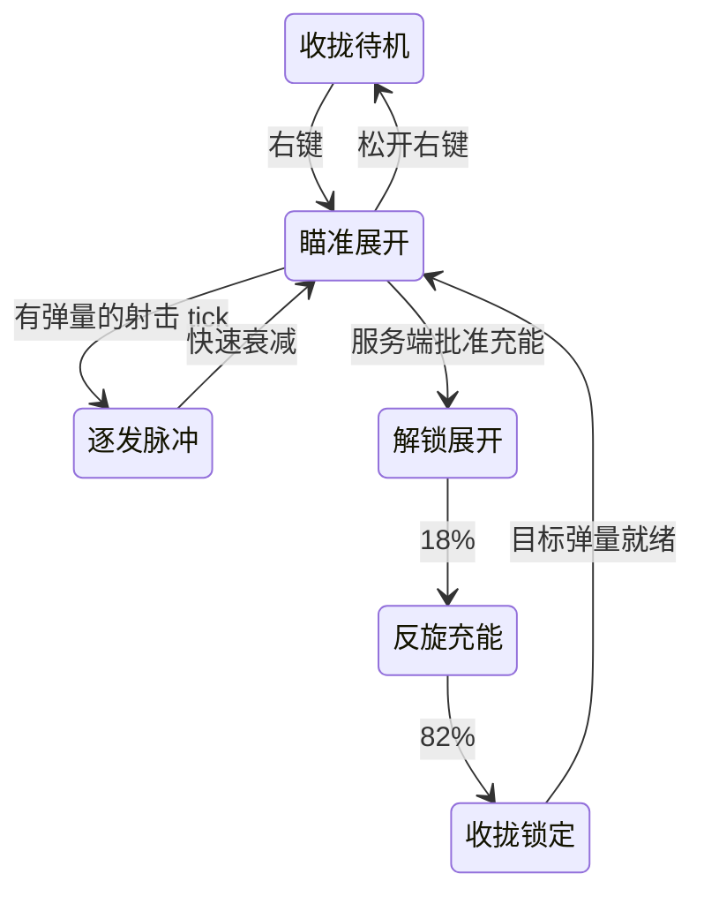

# 步枪虹膜光环

步枪使用六瓣折角虹膜、内外双层断环和 30 段弹量刻度。沿用原来的粉红光色、原位置及拇指上方的第一人称瞄准布局；头顶状态收拢，瞄准时只保留很小的中央点，外层始终留出中空视野。

大小在 `Assets/DollSinger/Prefabs/RifleHalo.prefab` 根物体的 `RifleHaloVisual` 组件中调：`Overall Scale` 是整体倍率，当前 1.35（比初版增大 35%）；`Idle Scale` 是头顶相对瞄准的收拢倍率。中央瞄准点独立于整体倍率，仍保持很小。`Ring Radius` 可进一步改变环与六瓣的比例，通常只需调整 `Overall Scale`。

连射：每发推进转子 12°，六瓣短促外扩，内环反向运动，灯带闪亮后快速衰减；弹量刻度逐发熄灭。动画按已有 `LastShotTick` 驱动，同一事件重放不会重复转动，空仓没有无条件震动。

充能沿用原来的 2 秒时长与服务端能量规则，分三个阶段：

| 进度 | 动作 |
|---|---|
| 0–18% | 六瓣解锁、径向展开，双环沿轴线分离 |
| 18–82% | 主转子转过 420°，内环反向旋转，充能弧绕行两圈，实际补充的刻度依次点亮 |
| 82–100% | 六瓣收拢，双环复位，闪亮锁定，弹量保持在服务端批准的目标值 |

第一人称充能时，支撑手在瞄准点下方向外下方扫动并转腕，射击手仍维持原来的拇指间隙。未重写 Animator、移动、伤害或输入权限。

资源：`Assets/DollSinger/Prefabs/RifleHalo.prefab` 和 `Runtime/RifleHaloVisual.cs`。预制体保存固定的线条对象，运行时复用顶点数组，不逐帧创建对象或材质。步枪图标从相同的几何重新生成。

安装入口：`Tools/Doll Singer/Install Rifle Iris Halo`，需要重新安装时会接入本地和网络角色预制体。`RifleHaloSetup.Validate` 检查绑定、拇指间隙、重复射击事件、充能重放、部分充能、空仓重置和中央点尺寸。`RenderPreview` 在独立预览场景里渲染动作帧，不进入战局、不修改玩家存档。

本地角色演示现也有独立的 30 发步枪弹仓和 R 充能，切换武器保留演示弹量；演示与真实战局的库存、电池供能彼此独立。

2026-10-08 验证：Unity 6000.5.10f1 批处理编译、预制体绑定和上述针对性状态检查通过；原生相机渲染了 5 秒射击与充能预览，位于 `LocalData/RifleHaloPreview/rifle-halo.gif`。尚未进行完整角色的 Play Mode 手势观感或双客户端验收。
