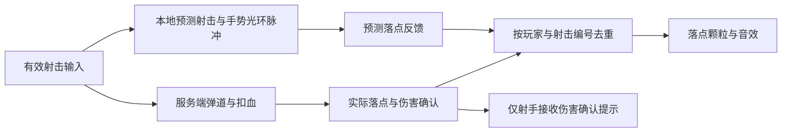

# 步枪手势与光环射击反馈

本轮集中打磨步枪，不更改射速、伤害、散射、瞄准倍率或弹道。单机与联网使用同一套表现。

## 释放与回稳

发射瞬间内环收紧并短促提亮，外环随后弹开、回稳。连续射击在已有运动上叠加脉冲，
幅度与压力都有上限；停止射击后自然衰减。中央小点保持稳定，仍沿最终瞄准方向对齐。
所有几何维持平面图形。

第一人称射击手向后、向下短促回弹并转腕，支撑手以较小幅度跟随。
射击手抬高，以距光环中心下方 0.035 米的大拇指尖作为可见瞄准参照；支撑手再低 0.08 米。
第三人称也有轻微的手臂回弹。保持骨骼长度，沿用原手指姿态和拇指下方留白。
动作不推动镜头，也不更改服务端发射位置。充能期间优先使用原充能手势。

可在 `RifleHalo.prefab` 的 `RifleHaloVisual` 中调：

| 字段 | 默认值 | 用途 |
|---|---|---|
| Release Expansion | 0.019 m | 外圈释放幅度，随后乘现有光环缩放 |
| Wrist Travel | 0.016 m | 射击手回弹距离 |
| Wrist Angle | 5° | 射击手转腕幅度 |

射击编号贯穿预测效果、远端效果与光环状态，相同编号不会重启释放动画或重复播射击音。
现有金属击音与清脆起音仍通过 SoundSystem 池播放；下一发使上一发余音短促淡出，
最后一发保留自然尾音。没有新增音频源或改写现有音频素材。

## 落点与确认

岩石／月壤为灰褐碎屑，金属为短促暖色火花，人物为少量粉色能量碎片，各自有落点声音。
默认地形和无标记表面按岩石处理。金属物理材质／渲染材质名称可被识别；
复杂道具可在碰撞体或父对象添加 `RifleImpactSurface` 明确指定表面类型。

本人的预测弹体碰撞立即表现落点；服务端通过现有 VFX 管理器发送实际碰撞事件。
同一玩家和输入 tick 的落点去重，预测弹体被接管后也不会重复播放。远端使用服务端事件，
即使弹体在快照到达前已销毁，仍能看到实际落点。
若服务端落点与预测明显不同，或落点表面类型被纠正，会补充表现实际服务端落点。

只有服务端实际扣血才显示短暂白色四角命中提示和轻提示音；致命伤害使用金色与更低的音调。
客户端碰撞、命中尸体、撞墙不触发伤害确认。提示中心留白并随 QE 侧身旋转。

落点由 VFX 管理器所属客户端维护，最多 16 组粒子，每组最多 16 颗，无逐发实例化。
反馈配置位于 `Assets/Resources/Moonkov/RifleFeedback.asset`，音效引用已有素材。
`Tools / Moonkov / Weapons / Create Missing Rifle Feedback` 只补缺失资源，保留 Inspector 调整。

客户端与服务器应使用同版本构建：射击效果 RPC 新增编号，并增加步枪落点事件。
最终回弹幅度、声音混合与持续连射观感仍需实际游玩确认。

## 本轮验证

Unity 编译与落点 Shader 检查通过。定向检查覆盖释放去重、连续射击上限、停火回稳、
不同帧步长一致性、平面顶点、固定小点、资源引用、预测／确认落点去重及粒子池容量。

使用临时独立档案完成一次实际单机战局检查：真实角色手腕回弹约 0.0132 m，
瞄准中心、镜头旋转和手臂长度保持稳定；真实服务端弹体造成非致命和致命伤害，
客户端收到落点事件并显示对应命中／击倒提示，随后返回菜单清理。
未使用正式玩家档案，未进行截图、完整双客户端验收或可执行程序构建。
