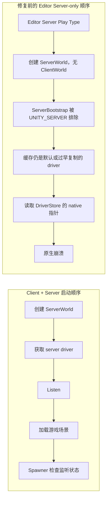

# Server-only 启动与原生崩溃修复

本文记录 `c0656990753cf81a4b88cfe091b40e3efb016a5f`（`fix: correct server-only startup and network driver lifetime`）所修复的问题。原生崩溃与 Server-only 启动不完整、客户端 UI 缺少 ClientWorld 是相互关联但不同的问题。

## 触发场景与原生崩溃

在 Unity Editor 中使用 Server Play Type 时，NetCode 创建 ServerWorld，但不会创建 ClientWorld。修复前，`ServerBootstrap` 只在 `UNITY_SERVER` 下编译，Editor 的 Server-only 流程因此没有运行专用服务器启动代码。`ManagerGhostsSpawner` 随后会询问 `GhostBridgeManager.IsServerListening()`；旧实现从管理器缓存的 `NetworkStreamDriver` 读取 `DriverStore`。

`DriverStore` 的访问会解引用 native 指针。旧代码缓存的是按值复制的 `NetworkStreamDriver` 包装值，它不会延长底层 native 存储的生命周期；在 ServerWorld 尚未准备好、驱动尚未有效初始化，或缓存仍是默认值时，读取 `DriverStore` 会触发原生崩溃，而不是返回普通的“尚未监听”结果。Editor Server-only 没有执行旧的服务器启动代码，是缓存保持默认值并暴露该问题的路径。Dedicated Server 的旧启动代码也在 `Listen` 前缓存驱动，依赖初始化时序。

## 为什么 Client + Server 看起来正常

Host 流程通过 `GameManager.StartGameAsync` 取得 ServerWorld 的 driver 并调用 `Listen`，然后才加载游戏场景。管理器 spawner 通常在这个顺序之后检查监听状态，缓存中的底层驱动此时已经初始化，所以问题被启动时序掩盖。Server-only 流程没有 Host 的连接启动步骤；Editor 旧版又没有编译 `ServerBootstrap`，因此会走到未设置的缓存值。Host 可运行不代表旧缓存方式安全。

## 修复内容

- `GhostBridgeManager.IsServerListening()` 每次从当前有效的 GameServer world 查询 `NetworkStreamDriver` singleton。没有有效 ServerWorld 或 singleton 时返回 `false`；查询完成依赖后，以 singleton 的读写引用读取 `DriverStore`，并检查 store、driver 和 `Listening` 状态。管理器不再保存复制出来的 driver 或 store。
- `GhostBridgeBootstrap.IsServerOnly` 统一识别 `UNITY_SERVER` 和 Editor 的 `RequestedPlayType.Server`。Editor 也会编译 `ServerBootstrap`，而非 Server-only 模式会立即禁用它。
- Server-only 下 `GameManager` 使用 `SoundSystemNull`，跳过客户端相机和菜单初始化；从主菜单启动时添加 `ServerBootstrap`，由它监听默认端口 `7979` 并加载游戏场景。
- `ManagerGhostsSpawner` 在监听尚未就绪或服务器 Ghost prefabs 尚未加载时继续等待；两项条件满足后才生成管理器并停用自身。
- `InGameHUD` 与 `RespawnScreen` 检查 ClientWorld 是否存在且仍有效。Server-only 没有 ClientWorld 时，它们隐藏客户端界面，不访问缺失的玩家查询。

启动路径和客户端界面防护用于让 Server-only 模式正常进入游戏；它们与 `DriverStore` 无效 native 指针导致的崩溃原因分别处理。

## 验证记录与边界

此前的手动验证记录为：Editor Server-only 能进入 `InGame`，服务器监听 `7979`，且没有创建 `ClientWorld`。本次提交任务只检查修复 commit 和当前代码并补充本文，没有重新启动 Unity。该记录不代表已验证远端客户端连接、完整对局行为或独立构建产物。
