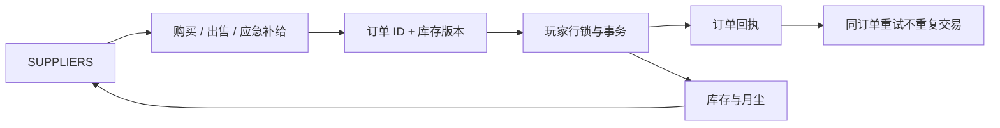

# 商店与应急补给

登录账号后，从 **SUPPLIERS → VIEW SUPPLIER** 打开商店。购买使用月尘，物品进入个人仓库；出售需要先将物品收回仓库。所有供应商暂时使用同一份基础货单。

| 物品 | 买入月尘 | 卖出月尘 | 占格 |
|---|---:|---:|---|
| 步枪光环 | 40 | 20 | 2×2 |
| 六发左轮光环 | 15 | 7 | 1×1 |
| 霰弹枪光环 | 50 | 25 | 2×2 |
| 能源电池（满电每个） | 5 | 2 | 1×1，最多叠 12 个 |

每节满电电池有 100 能量，买入为满电，卖出按实际卖出电量折算月尘、向下取整。拆卖部分堆叠优先卖满电电池，保留未满电池及其余量。具体充能规则见 `BatteryEnergy.md`。

输掉全部光环时，进入 **SUPPLIERS → EMERGENCY SUPPLY → CLAIM FREE KIT**，免费领取一把六发左轮和 3 个能源电池。左轮自动装备在手枪槽，电池优先放入可携带空间；空间不足时尝试放进仓库。若整包无法安置，领取失败且库存不变。

领取条件检查整个物品树，包括容器内的光环；已有任何光环时不能领取。应急物品不能出售，不能与普通电池合并；移动、部署、死亡掉落和撤离都保留应急标记。之后再次失去全部光环，可以再次领取，不设置每日等待。

交易期间不能处于未结束战局。价格由服务端提供，交易在后端持有玩家行锁的数据库事务中完成，同时检查库存版本。每份订单使用唯一请求 ID 和内容指纹；网络中断后 **CHECK LAST ORDER** 重试原订单，重复请求不再次扣款或发货。资金不足、仓库满、过期库存或不允许出售等失败均不改动原库存。`inventory_trades` 为增量数据库迁移，不重建旧存档。

验证：Unity 脚本编译通过；`Backend/ShopChecks` 在自动删除的临时 PostgreSQL 数据库中通过 56 项检查，覆盖真实 HTTP 鉴权、购买与出售、幂等重试、并发、失败回滚、应急包、应急电池来源标记及战局锁。界面实际 Play Mode 操作和最终视觉仍需游戏内验收。测试不会修改玩家存档。
