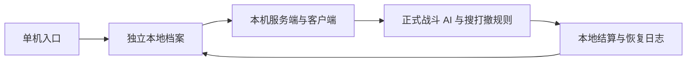

# 独立单机战局

主菜单左下角点击 **单机模式 / SINGLEPLAYER**，打开本机独立档案。
使用现有仓库界面整理装备、选择携带电池、向供应商购买物品；行动准备完成后
直接进入本机战局，不需要填写地址、端口或登录账号。

需要包含服务端模拟代码的 **Client+Server** Player 或 Unity Editor。
仅 Client 的构建会禁用单机入口。Client+Server 构建本身只是提供本机开服能力，
单机入口另外选择本地存档和回环连接，跳过账号服务、Relay 和数据库。

## 战局与存档

- 沿用正式地图的 AI、战斗、拾取、医疗、撤离和结算规则。
- 初始独立档案包含装备、100 月尘、12 颗电池和 4 支医疗注射器；初始光环武器在仓库中，出战前拖入装备栏。
- 出战先保存装备扣除记录；撤离成功返回携带的装备与战利品，死亡、超时或中途退出会丢失本局携带物品。
- 返回菜单、再次部署和重启后继续使用这个档案。供应商和库存操作同样保存在本机。
- 主菜单的 **联网账号 / ONLINE ACCOUNTS** 按钮切回登录界面；单机和联网的仓库分别保存。

本机战局只监听 `127.0.0.1`，使用系统分配的端口，且仅接受一个玩家。
无需启动独立 Server 程序、PostgreSQL、MoonPersistence、VPS 或 WireGuard。

存档位于 `Application.persistentDataPath/SinglePlayer/profile-v1.json`。
Windows 上通常在 `%USERPROFILE%/AppData/LocalLow/<Company>/<Product>/SinglePlayer/`。
Editor 在 `SinglePlayer` 内按项目路径建立子目录，避免 MPPM 副本互相覆盖。

完整快照以临时文件写入并刷新磁盘，再原子替换正式文件；上一版保留为 `.bak`。
正在打开的档案有独占文件锁，避免两个游戏实例同时写入。
损坏或不支持的存档会报错并保留原文件，不自动清空仓库或退回旧进度。
`raid-outbox` 保留出战和结算日志：先重放待保存的结算，再处理未完成的战局；
相同结算、部署和供应商订单不会重复扣装备或发放奖励。

## 验证范围

完成 Unity 编译检查，以及存档重载、库存移动、重复订单／部署／结算、死亡损失、
出战日志恢复、独占访问和损坏文件保留的针对性检查。
Play Mode 中使用临时档案验证了回环开局、角色生成、本地出战记录和返回菜单清理。
实际地图的操作手感和长时间游玩由玩家体验确认。
