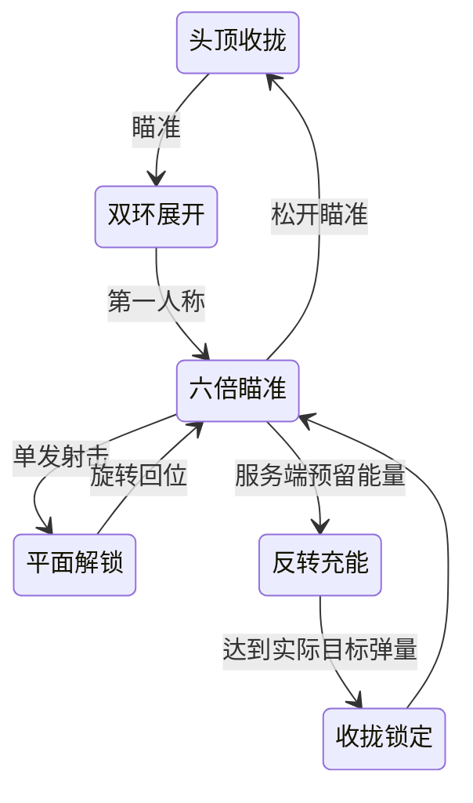

# 狙击光环

狙击枪是独立库存物品 `sniper`，武器 ID 5，占 2×2 四格，可放主武器或副武器栏。商店价格由 `ShopModel.cs` 中的 `ShopCatalog` 配置，不自动赠送给旧角色。弹量随物品保存，存仓、切换、死亡掉落和撤离沿用现有库存流程。

| 参数 | 初始值 | 调整位置 |
|---|---|---|
| 弹仓 | 5 发 | `Assets/DollSinger/SniperWeapon.asset` → Magazine Size |
| 伤害 | 110 | 同资源 → Damage |
| 射击间隔 | 1.4 秒，单发 | 同资源 → Cooldown In Ms / Automatic |
| 充能 | 3 秒，每补一发 18 能量 | 同资源 → Reload Time / Energy Per Round |
| 弹道 | 800 m/s、月面重力 1.62 m/s² | 同资源 → Projectile Speed / Gravity |
| 第一人称倍率 | 6 倍 | `Assets/DollSinger/Prefabs/SniperHalo.prefab` → Scope Magnification |
| 光环大小 | 1.55 倍 | 同预制体 → Overall Scale |
| 瞄准镜在画面中的直径 | 屏幕高度的 80% | 同预制体 → Scope Viewport Fraction |
| 平面色带宽度 | 0.020 | 同预制体 → Line Width |

双层断环、五颗电容和充能弧使用更宽的纯平面色带，以面积强化图形。不带实体框、倒角或高光渐变；所有图形顶点保持在同一个平面内。中央小点宽度 0.0013、距离刻度宽度 0.0018，独立于色带宽度。

光环采用冰蓝双层断环、五颗菱形电容及外围距离刻度。头顶时收拢；瞄准时同心双环在平面内扩大，第一人称相机按投影正切得到真实 6 倍目标放大。光环尺寸同步补偿倍率，中央视野保持中空，小点固定，不受外环运动影响。第三人称保持原来的常规瞄准倍率。

射击反馈先短促展开、闪亮，再执行约 0.9 秒的平面解锁旋转、径向外扩与回位，表现单发锁定节奏。充能时双环反转、五颗电容绕行并按服务端批准的实际目标弹量点亮，最后收拢闪亮锁定；支撑手在瞄准点下方扫动、转腕。

安装入口：`Tools/Doll Singer/Install Sniper Optic Halo`。验证入口 `SniperHaloSetup.Validate` 针对注册、两个角色绑定、买入装备存仓卖出、部分能量守恒、旧快照重放和瞄准倍率恢复。`RenderPreview` 在独立场景渲染光环动作，不修改战局或账号。

本地角色演示可在 `DollSingerHaloAim` 的 Local Primary / Local Secondary 选择 Sniper；真实战局需从商店购买后在库存中装备。演示有独立弹量，不代表账号获得物品或免费充能。

2026-10-08 验证：Unity 编译、针对性检查和原生光环动作渲染通过，Console 无错误；后端编译通过。本地数据服务已加载新的商店目录，保留原来的监听地址，健康状态为 `ready`。检查使用内存库存，没有改动玩家物品。尚未验收完整角色的 Play Mode 手势、实战伤害手感及双客户端表现。

平面版本移除了实体框及其网格、材质和脚本。原生动作预览使用正面视角，展示同心镜环展开、平面解锁与五颗电容充能。

2026-10-08 平面修正验证：Editor 脚本执行及原生渲染通过；针对头顶、瞄准、开火和装弹状态检查了共面顶点、实体框移除、独立小点及两个角色绑定。小电容改为清晰的实心平面菱形，图标同步更新。未进行完整角色 Play Mode 观感或双客户端验收。
