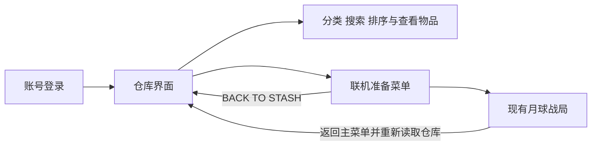

# 仓库界面

> 当前 Character、仓库和战局 Tab 已升级为真实容器树与服务端移动，见 [容器系统](ContainerInventory.md)。下文保留早期界面阶段记录，其中“装备仅展示”、三种资源单堆叠和旧筛选交互不再描述当前容器视图。

登录后默认进入仓库。页面采用装备区、方格仓库、物品详情和底部出战导航的布局，沿用现有 UI Toolkit PanelSettings 的 1920×1080 缩放规则。

## 已接入的交互

- 月尘、合金、能源电池显示账号的真实库存；数量为零时不会创建虚构物品。
- 每种资源展示为一个数量堆叠，月尘占 2×2、合金占 2×1、能源电池占 1×2。格子尺寸只是表现，不改变数据库容量与数量规则。
- 支持 ALL / MATERIALS / ENERGY 分类、名称搜索、按名称或数量排序。
- 点击物品查看类别、说明和拥有数量。搜索隐藏所选物品时清除详情。
- REFRESH 重新读取账号仓库。返回主菜单时也自动读取最新仓库；网络失败显示 UPDATE FAILED，悬停可查看原因。
- PREPARE RAID / MAIN MENU 进入现有联机准备菜单，BACK TO STASH 返回仓库。角色选择、Direct / Relay 和现有开局流程继续使用原来的实现。
- LOG OUT 使用现有退出登录接口。

装备区的默认光环、服装、空装备槽、口袋与出战背包是本轮界面展示，尚未接装备数据库、拖拽、移动、穿戴或物资扣库。默认套装不表示账号已拥有额外可交易物品。

## 编辑位置

| 文件 | 职责 |
|---|---|
| `Assets/UI Toolkit/GameUI/StashScreen.uxml` | 页面结构，可在 UI Builder 中编辑 |
| `Assets/UI Toolkit/GameUI/StashScreen.uss` | 颜色、间距、尺寸、格子与按钮样式 |
| `Assets/Scripts/UI/Game/StashScreen.cs` | 库存展示、筛选、排序、选择与导航回调 |
| `Assets/Scripts/UI/Game/StashVisuals.cs` | 原创矢量物品图形与网格绘制 |
| `Assets/Scripts/UI/Game/MainMenu.Account.cs` | 登录、仓库、联机准备页面的衔接 |

物品与装备图形通过 Painter2D 绘制，未导入其他游戏的图片，也没有新增 UI 包。后续可在这些图形位置接入自己的物品美术资源。

## 验收

主页面及模板已通过 Unity 导入和编译检查，离屏构建的界面已确认账号数量显示正确。本轮不自动 Play 或截图。停下当前 Play 后重新进入，确认布局、物品点击、滚动和菜单切换；视觉效果由你判断。本轮未修改数据库表或联机协议，也未自动 commit。
